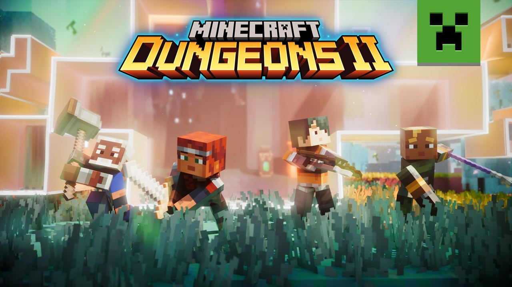
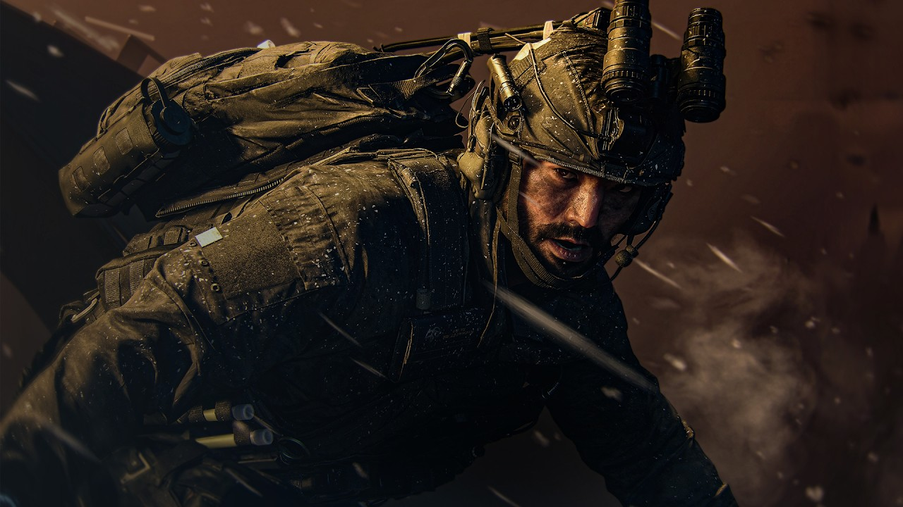
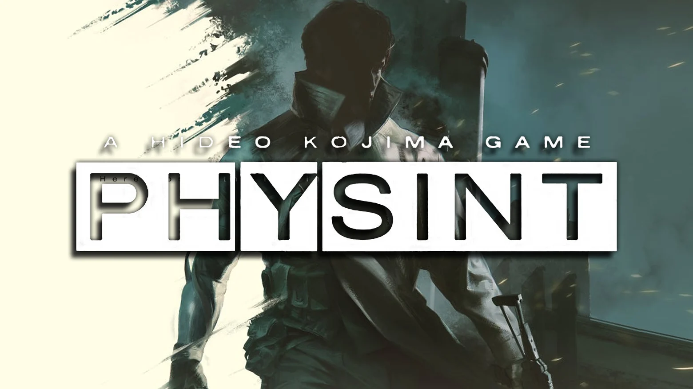

Xbox ya tiene fecha para su regreso a Tokyo Game Show. La compañía emitirá un directo el **jueves 17 de septiembre de 2026** en el que mostrará parte de su catálogo para los próximos meses y que, además, servirá para conmemorar el 25.º aniversario de la marca Xbox. El evento se podrá seguir en directo o en diferido, según detalla Windows Central.

## Cuándo y dónde ver el directo

La retransmisión arrancará a las **19:00 (JST)**, lo que equivale a las **3:00 (PT)**, las **6:00 (ET)** y las **11:00 (BST)** del mismo día. En horario peninsular español, la cita cae de madrugada, así que lo más práctico para el público hispanohablante será recurrir a la versión bajo demanda.

Las plataformas confirmadas son las habituales de la compañía:

- `youtube.com/@XBOXJapan`
- `youtube.com/XBOX`
- `twitch.tv/XBOX`

## Lo que ya está confirmado

Microsoft no ha dejado el cartel vacío. Dos títulos tienen presencia asegurada y, además, serán jugables en el recinto de Tokyo Game Show para quien asista en persona:

- **Minecraft Dungeons 2**, un RPG de acción con estructura de mazmorras y botín, en la línea de la saga Diablo.
- **Call of Duty: Modern Warfare 4**, la nueva entrega de la subsaga Modern Warfare, con campaña para un jugador y modos multijugador 6v6.

El evento también tendrá un componente presencial: la **Xbox FanFest** organizará una watch party del directo con invitados especiales, entre ellos Misuzu Araki y Larry Hyrb.

## La gran incógnita: Physint y otros regresos

Fuera de lo confirmado, el nombre que más suena es **Physint**, el juego de acción y sigilo de Kojima Productions planteado como sucesor espiritual de Metal Gear Solid. Según recoge Windows Central, el proyecto nació como exclusivo de PlayStation, pero tras el intento de Sony de cancelarlo, Hideo Kojima rompió relaciones con la compañía y permitió que Xbox lo publicara. Sería un golpe de efecto difícil de igualar en un escaparate japonés.

A ese deseo se suman otras peticiones recurrentes de la comunidad, como ver material de **Spyro: A Realm Beyond** o de **Persona 6**, confirmado para Xbox Series X|S y Game Pass. Por ahora son expectativas, no anuncios.

## Por qué importa

Tokio es el escenario natural para que Xbox reivindique su relación con el mercado japonés, históricamente su punto más débil frente a Nintendo y PlayStation. Que el directo coincida con el 25.º aniversario no es casual: la compañía busca mezclar nostalgia con una señal clara hacia el público nipón y hacia los estudios de la región.

Para el jugador de habla hispana, la cita es sobre todo una ventana a lanzamientos que llegarán a Game Pass y a las consolas de la casa. Si el directo cumple con lo confirmado y suma alguna sorpresa de peso, Xbox habrá convertido una fecha menor del calendario en uno de sus momentos más relevantes del año. La duda razonable es si el anuncio estrella será real o si, como tantas veces, la expectativa superará al contenido.
