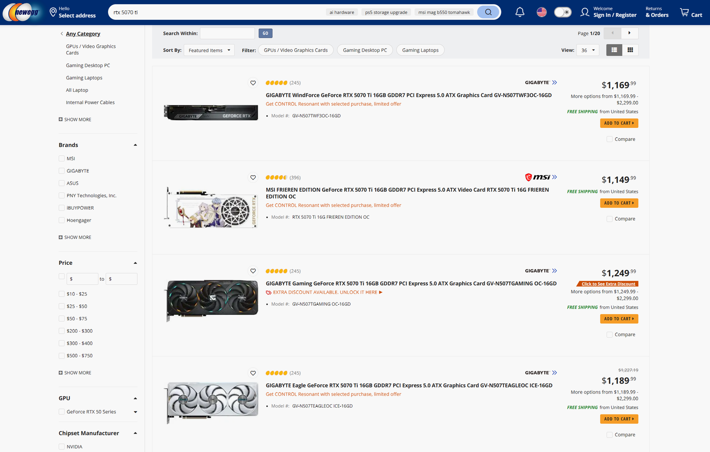
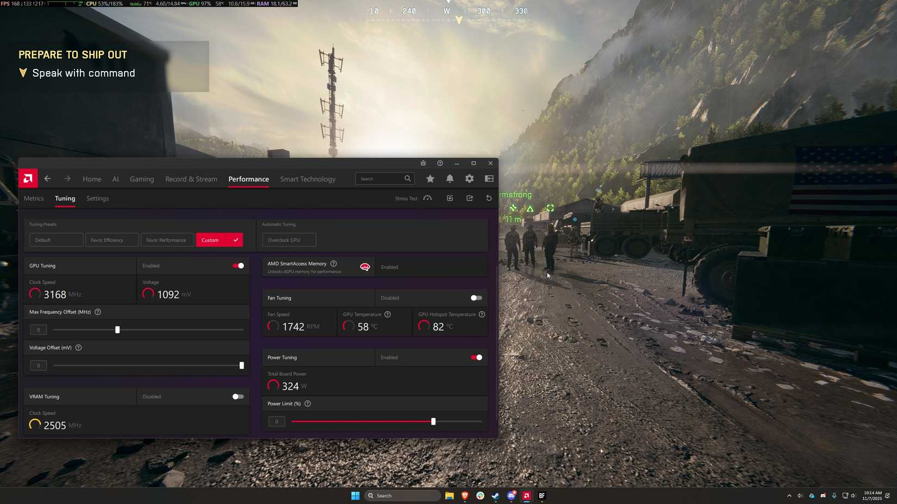
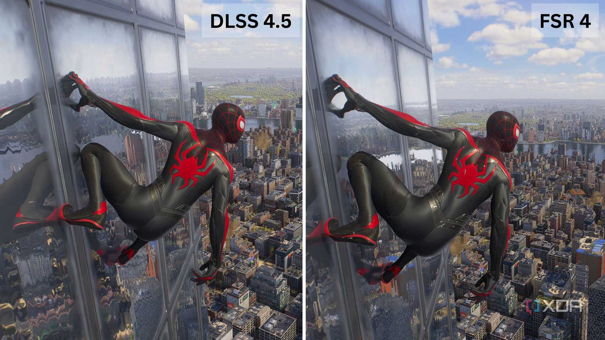
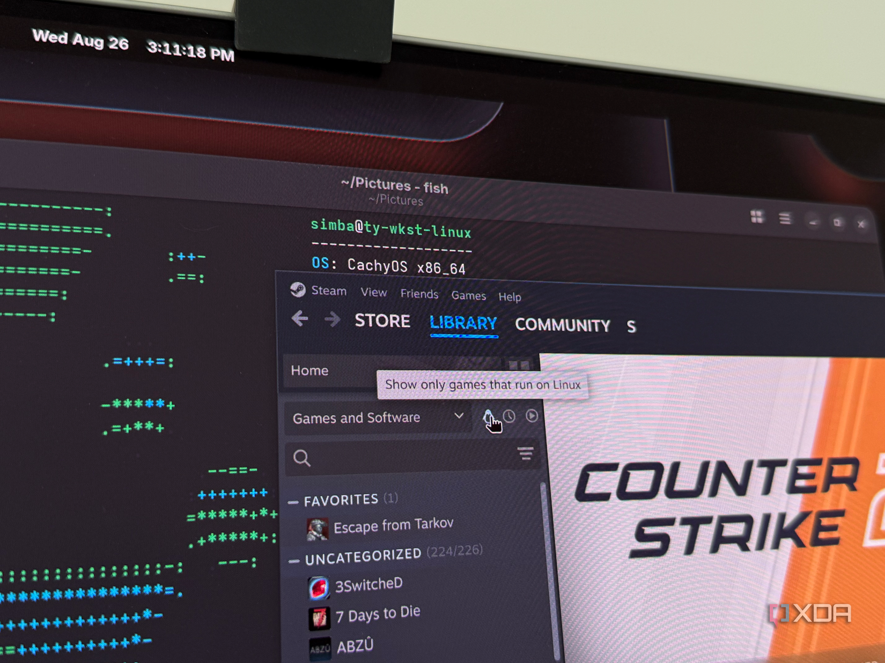

Montar un PC completamente nuevo con piezas actuales se ha vuelto un ejercicio complicado si el presupuesto es ajustado. La memoria RAM encabeza el sobrecoste, con kits que cuestan el doble o el triple que antes para la misma capacidad, pero las tarjetas gráficas tampoco se quedan atrás: casi todas se venden muy por encima de su precio recomendado. En ese contexto, el análisis publicado por XDA Developers defiende que la Radeon RX 9070 XT es la mejor opción en relación calidad-precio para jugar a alta resolución y alta frecuencia de refresco.

## La brecha de precio entre la RX 9070 XT y la RTX 5070 Ti

La comparativa directa es con su rival más cercano, la GeForce RTX 5070 Ti. En el lanzamiento, ambas estaban separadas por unos 150 dólares en precio recomendado: 599 dólares frente a 749 dólares. En rendimiento, según la nueva prueba de 52 juegos de Hardware Unboxed citada por XDA Developers en mayo de 2026, quedan a pocos fotogramas de distancia tanto en 1440p como en 4K.

La diferencia aparece al mirar los precios reales. La RX 9070 XT se encuentra entre unos 750 y 850 dólares, mientras que la RTX 5070 Ti parte de unos 1.150 dólares cuando hay existencias. Con esos números, el cálculo de coste por fotograma favorece con claridad a AMD: en torno a un 51 % de sobrecoste por fotograma en 1440p y un 48 % en 4K a favor de la opción de NVIDIA, para una ganancia de un solo dígito porcentual en rendimiento medio.

Para el lector en España conviene leer estas cifras como referencia del mercado estadounidense: los importes en euros y la disponibilidad en tiendas europeas varían, pero la jerarquía que describe el artículo —dos tarjetas muy próximas en rendimiento con una diferencia amplia en precio de calle— es lo relevante a la hora de planificar la compra.

## Qué suponen esos 400 dólares de ahorro para el resto del equipo

El artículo calcula un ahorro aproximado de 400 dólares al elegir la tarjeta de AMD con los precios actuales. Ese margen, sostiene, transforma el resto de la configuración mucho más que unos pocos fotogramas adicionales.

Esa cantidad puede marcar la diferencia entre montar un solo módulo o dos módulos de memoria DDR5 en doble canal, saltar a un SSD de mayor capacidad, subir un escalón de procesador o aspirar a un monitor de mayor resolución. El texto cita como ejemplo el salto entre un Ryzen 7 9700X y un Ryzen 7 9850X3D en juegos limitados por CPU, o entre uno y dos módulos de DDR5: mejoras del día a día más perceptibles que esa pequeña ventaja media en juegos. También existe [una edición especial Nitro+ de la RX 9070 XT](/noticias/sapphire-nitro-rx-9070-xt-valor-mortis/) para quien busque un modelo concreto dentro de la misma familia.

## Controladores, reescalado y el punto fuerte en Linux

El matiz importante está en el software, porque en 2026 se compra un conjunto de controlador y funciones, no solo el chip. XDA Developers reconoce que los controladores de NVIDIA han tenido tropiezos puntuales desde el lanzamiento de Blackwell, pero describe su uso diario —aplicación NVIDIA incluida— como estable en general.

De AMD destaca la paridad de funciones —FreeSync, generación de fotogramas AFMF o Radeon Anti-Lag—, aunque con una experiencia más irregular según la combinación de equipo y ajustes: tiempos de espera del controlador difíciles de diagnosticar y casos concretos como tartamudeo con FreeSync en una pantalla de 240 Hz, resuelto al desactivarlo en ambas pantallas.

 En reescalado, FSR 4 ha mejorado de forma notable, pero su soporte por juegos es más limitado que el de DLSS 4.5 con modelo Transformer, presente en prácticamente todos los títulos modernos que ya soportaban DLSS 4.

La excepción es Linux, donde la experiencia descrita se invierte: el controlador de AMD forma parte del propio núcleo y su controlador Vulkan se distribuye con Mesa, sin nada adicional que instalar o sincronizar tras cada actualización, y FSR 4 funciona a través de Proton. Si el destino principal del equipo es Linux, la recomendación se inclina aún más hacia Radeon.

En conjunto, la conclusión del medio original es matizada: la RX 9070 XT es la campeona actual del valor en coste por fotograma aun vendiéndose por encima de su precio recomendado, siempre que el comprador acepte posibles ajustes de controladores; la RTX 5070 Ti resulta más sencilla de instalar y jugar desde el primer día, con mayor probabilidad de que las funciones destacadas estén soportadas en el juego elegido.
