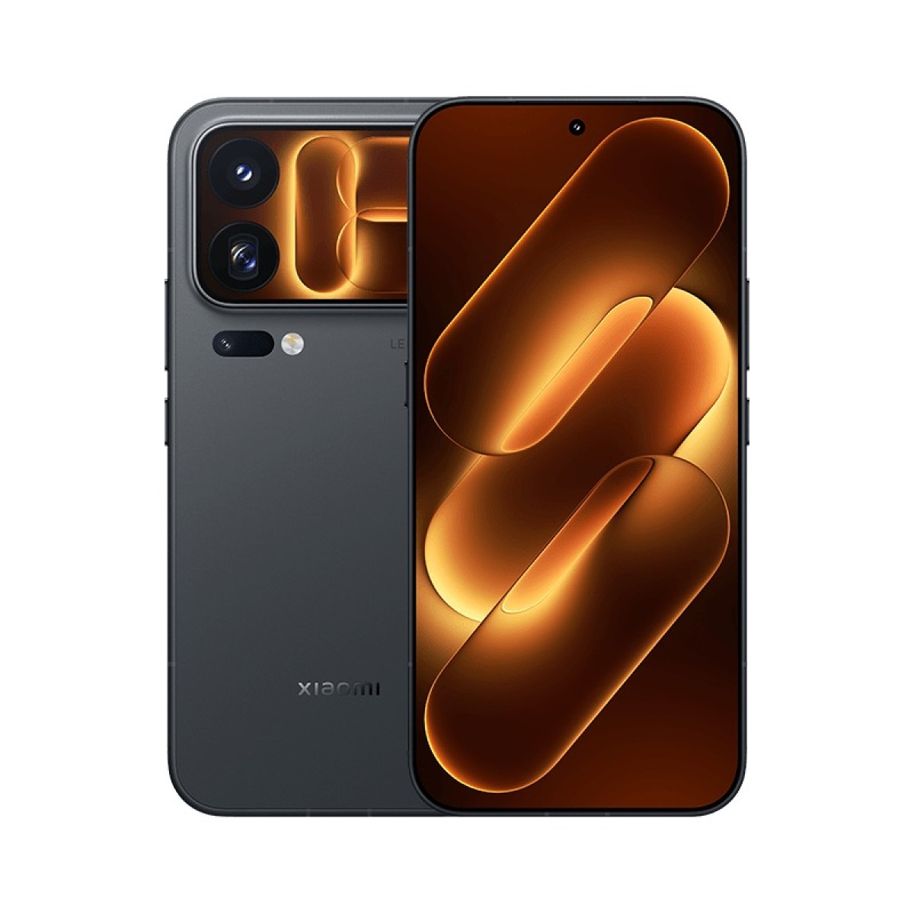
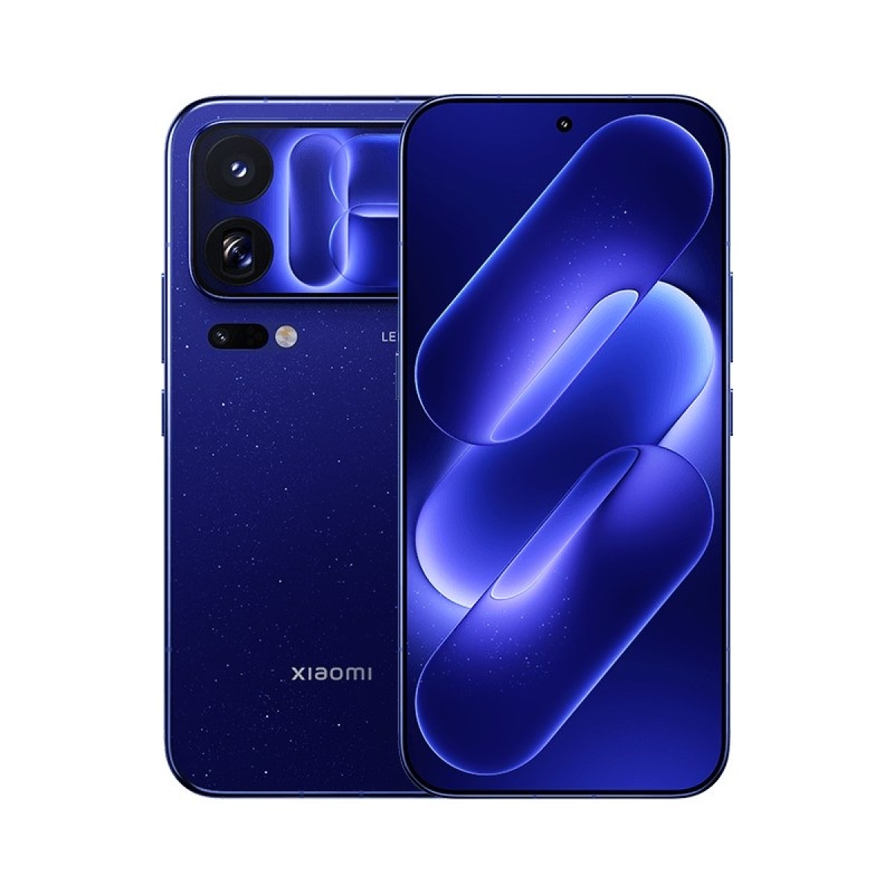
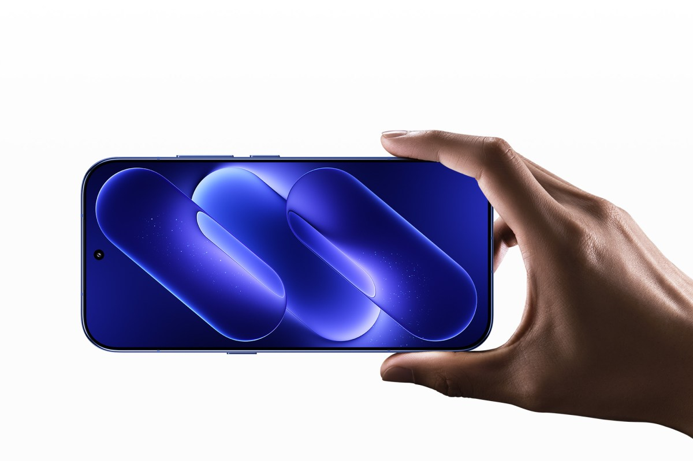
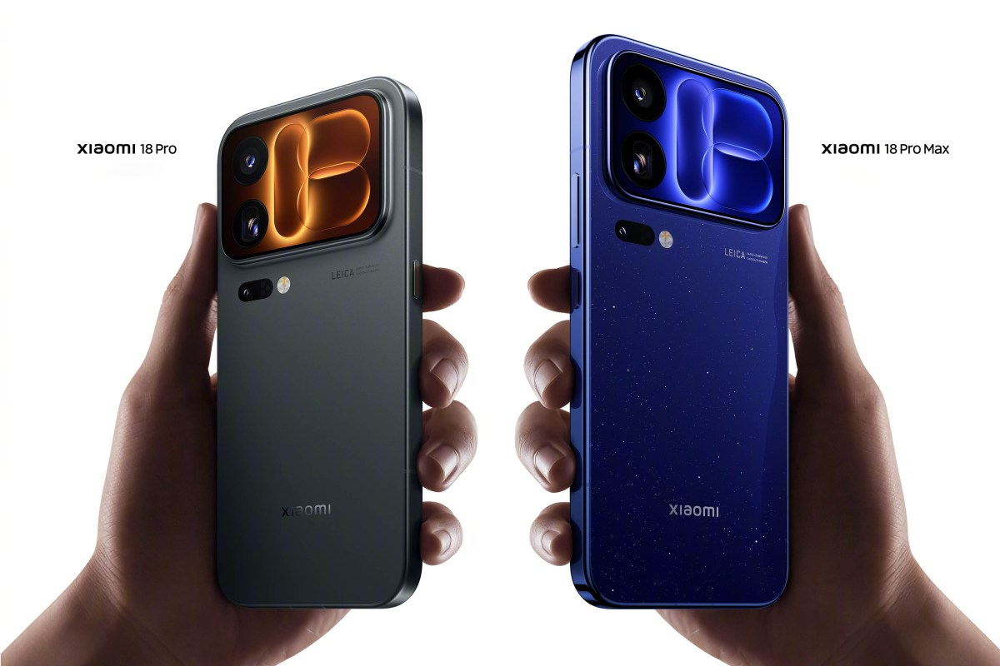
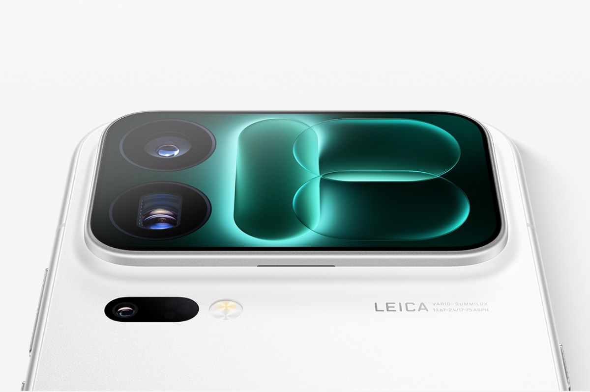
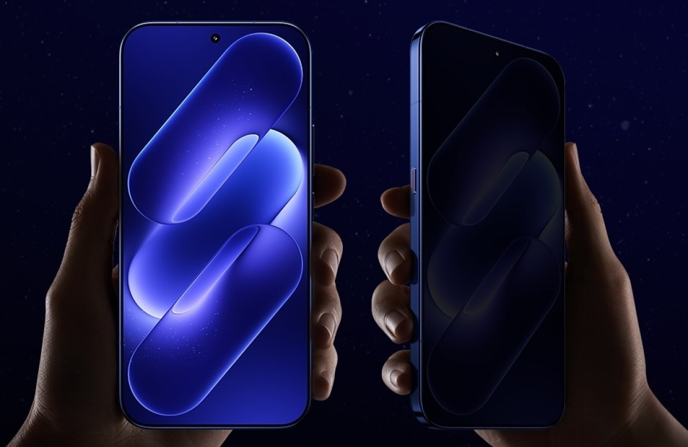
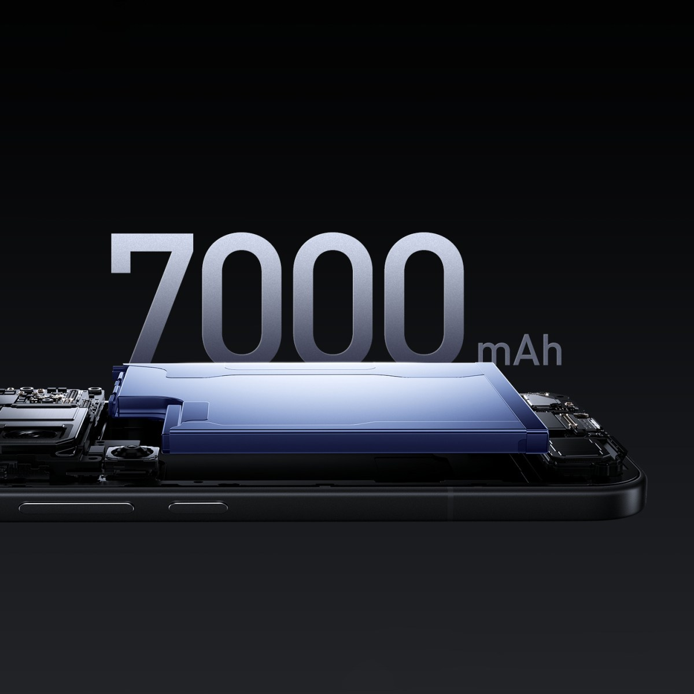
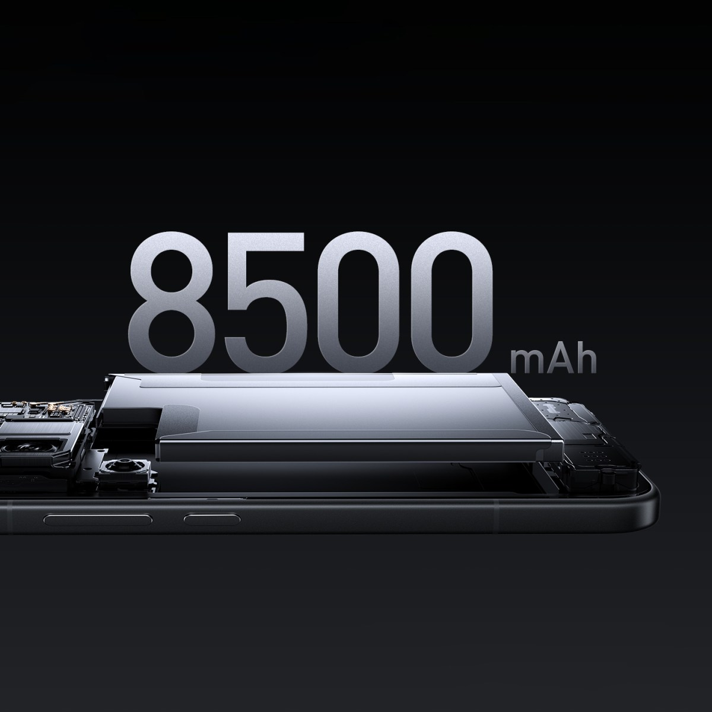
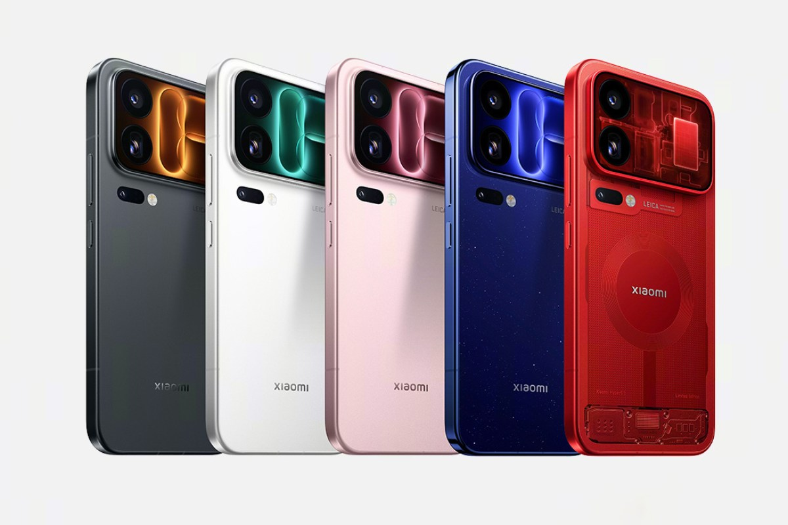

Xiaomi ha presentado en China los **Xiaomi 18 Pro y 18 Pro Max**, la nueva generación de su
familia insignia, apenas unas horas después de que Qualcomm desvelara sus nuevos procesadores.
El modelo estándar se convierte en el primer teléfono del mercado con el Snapdragon 8 Elite Gen 6,
mientras que la variante Max se queda con la versión Extreme del mismo chip. La marca confirmó que
habrá lanzamiento global más adelante este año.

## Qué han presentado los Xiaomi 18 Pro

Los dos teléfonos comparten una ficha técnica muy similar y se distinguen sobre todo por el tamaño.
La pantalla frontal es un panel LTPO AMOLED con resolución 2K y refresco variable de 1 a 120 Hz:
6,4 pulgadas en el 18 Pro y 6,9 pulgadas en el 18 Pro Max. Ambos alcanzan los 4.000 nits de brillo
máximo y están protegidos con el cristal Dragon Crystal Glass 3.

En la cara posterior se mantiene la seña de identidad de la generación anterior: una segunda
pantalla que ahora gana funciones. Mide 2,7 pulgadas en el modelo pequeño y 2,9 pulgadas en el Max,
con refresco de hasta 120 Hz, y admite más de 100 tarjetas de aplicaciones en el lanzamiento, desde
notificaciones y controles rápidos hasta minijuegos. Xiaomi permite además crear mini apps propias
con ayuda del asistente Xiao AI, como un recordatorio para beber agua o un temporizador para cocer
un huevo, así como generar fondos de pantalla personalizados.

Ese panel secundario cumple también la función de visor para las cámaras traseras, útil para
autofotos con los sensores principales.

## Cámaras Leica y privacidad de nivel hardware

El apartado fotográfico es idéntico en ambos modelos y lleva la firma de Leica. El conjunto combina
un sensor principal de 200 megapíxeles y 1/1,28 pulgadas (Light Hunter 960), un teleobjetivo
periscópico también de 200 megapíxeles y 1/1,56 pulgadas con zoom óptico de 3,2 aumentos, y un
ultraangular de 50 megapíxeles con 102 grados de campo de visión. El teleobjetivo admite retratos a
75 mm, macro a 12 cm y un zoom sin pérdida de hasta 12,8 aumentos.

Xiaomi acompaña el hardware con su nuevo sistema de imagen Legendary Moment, que reparte el
procesado entre el propio teléfono y la nube, y añade tres estilos de cámara dedicados.

La gran novedad funcional es la pantalla de privacidad. A diferencia de las soluciones que oscurecen
el panel por software, la de Xiaomi actúa a nivel de hardware para impedir que alguien mire de lado
lo que se muestra en pantalla. La compañía va un paso más allá que el Privacy Display del Samsung
Galaxy S26 Ultra: permite activarla por ubicación, bloquea notificaciones, ventanas flotantes y
vistas divididas, y puede hacerlo sola gracias a la cámara frontal, que detecta miradas ajenas.

Todo se maneja desde un botón dedicado con funciones de IA situado en el lateral izquierdo, que
también sirve para abrir el asistente, tomar notas de voz o activar el modo silencio.

## Batería, precios y disponibilidad

Las baterías crecen respecto a la generación anterior. El Xiaomi 18 Pro monta una celda de
7.000 mAh, un 11 % más grande, y el 18 Pro Max sube hasta los 8.500 mAh, un 13 % más. Ambos
admiten carga por cable de 100 W, carga inalámbrica de 50 W y carga inversa de 27 W. Llegan con
HyperOS 4 y protección IP69 contra agua y polvo.

El precio de salida es de 5.999 yuanes (unos 895 dólares) para el 18 Pro y de 6.999 yuanes (unos
1.045 dólares) para el 18 Pro Max, en ambos casos con 12 GB de RAM y 256 GB de almacenamiento.

| Configuración | Xiaomi 18 Pro | Xiaomi 18 Pro Max |
| --- | --- | --- |
| 12 GB / 256 GB | 5.999 yuanes (895 $) | 6.999 yuanes (1.045 $) |
| 12 GB / 512 GB | 6.999 yuanes (1.045 $) | 7.999 yuanes (1.193 $) |
| 16 GB / 512 GB | 7.999 yuanes (1.193 $) | 8.999 yuanes (1.343 $) |
| 16 GB / 1 TB | 8.999 yuanes (1.343 $) | 9.999 yuanes (1.492 $) |
| 16 GB / 1 TB (Special Edition) | 9.999 yuanes (1.492 $) | 10.999 yuanes (1.642 $) |

Los colores estándar son negro, blanco, rosa y azul, a los que se suma una edición especial roja
con elementos transparentes en la parte trasera.

## Qué cambia para el comprador

Por ahora, el lanzamiento se limita a China y las cifras en yuanes no anticipan el precio en euros
que tendrán cuando lleguen a España. La clave está en la confirmación de Xiaomi: habrá lanzamiento
global este año y, esta vez, incluirá a los modelos Pro, algo que no ocurrió con la generación
anterior y que ya se anticipó en la [nota sobre la fecha de presentación](/noticias/xiaomi-18-pro-launch-date/).

Para el usuario, la serie 18 Pro apunta a dos frentes. Uno es la pantalla de privacidad, que deja
de ser un extra exclusivo del rival de Samsung y se convierte en un argumento de la gama alta de
Xiaomi. El otro es la autonomía: con 7.000 y 8.500 mAh, estos móviles apuntan a varios días de uso
sin cargador, aunque habrá que verificar ese rendimiento en las pruebas reales. El movimiento
encaja con el resto del ecosistema que Xiaomi está construyendo alrededor de HyperOS 4 y de su
asistente con IA, y llega en un momento en el que el [nuevo Snapdragon Extreme Gen 6](/noticias/qualcomm-snapdragon-8-elite-extreme-gen-6-oficial/)
empieza a desembarcar en los buques insignia de todo el sector.
