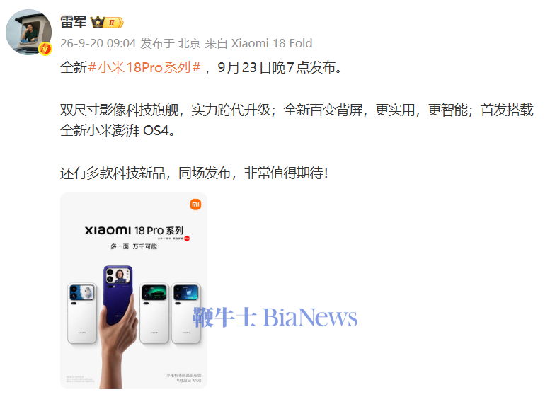
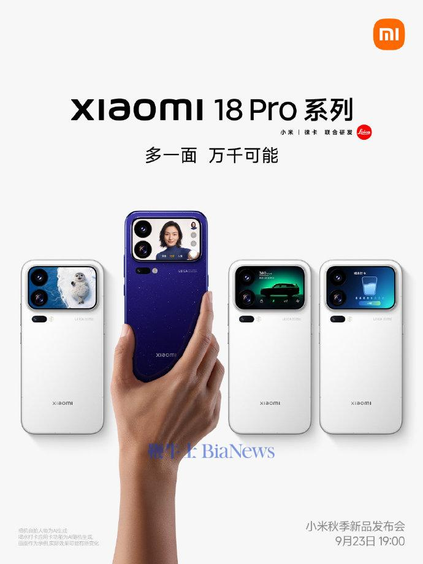

El consejero delegado de Xiaomi, Lei Jun, anunció el 20 de septiembre que la serie Xiaomi 18
Pro se presentará el miércoles 23 de septiembre a las 19:00, hora local de China (las 13:00 en
la España peninsular). El directivo acompañó el aviso con la fecha y la hora del evento, y la
compañía ha empezado a calentar motores con un cartel en el que presenta la familia como una
serie insignia de imagen disponible en dos tamaños.

Según el propio anuncio, el acto servirá para mostrar dos novedades principales: una pantalla
trasera variable y el estreno de HyperOS 4, la nueva versión del sistema operativo de la marca.

## Xiaomi 18 Pro: una cita en el calendario de otoño

La fecha elegida sitúa la presentación dentro de la temporada de lanzamientos de otoño en China,
un periodo en el que las principales marcas concentran sus propuestas de gama alta. El anuncio
no se limita al teléfono: la compañía adelanta que presentará otros productos tecnológicos en el
mismo evento, aunque por ahora no ha detallado cuáles.

La ventana también importa para el mercado español. Xiaomi suele lanzar primero sus buques
insignia en China y después extenderlos a Europa, de modo que la cita del 23 de septiembre marca
el punto de partida del que dependerán las fechas de llegada a España. Con todo, la marca no ha
confirmado nada sobre disponibilidad internacional.

## Pantalla trasera variable y el estreno de HyperOS 4

El apartado que más ha llamado la atención es la pantalla secundaria. Xiaomi la describe como una
pantalla trasera versátil, pensada para mostrar información y contenido distinto según el momento,
tal como se aprecia en el material promocional. La propuesta retoma una idea que la marca ya había
explorado en generaciones anteriores: aprovechar la cara posterior del teléfono para funciones
rápidas y para personalizar el equipo sin encender la pantalla principal.

Junto a la pantalla, el otro nombre propio es HyperOS 4. El anuncio lo presenta como un estreno,
lo que convierte a esta familia en la primera en llegar con la nueva versión del sistema. Es un
detalle relevante para el usuario, porque el software determina funciones como la integración con
otros dispositivos de la casa, la gestión de la batería o el soporte a largo plazo. En el cartel
también aparece la colaboración con Leica en el apartado fotográfico, una alianza que Xiaomi
mantiene en sus modelos de gama alta.

## Lo que todavía no se sabe

El anuncio es, por ahora, una fecha y un puñado de pistas. Ni el precio, ni el procesador, ni el
resto de la ficha técnica se han hecho públicos. Tampoco se conocen los modelos exactos que
compondrán la serie ni sus diferencias más allá de los dos tamaños mencionados. Xiaomi ha dejado
claro que esos datos llegarán durante la presentación, así que cualquier cifra que circule estos
días debe tratarse como especulación.

## Qué cambia para el lector

Para quien esté pensando en renovar su teléfono, la cita del 23 de septiembre conviene tomarla
como un punto de referencia y no como una promesa de compra inmediata. Lo habitual en Xiaomi es
que pasen semanas o meses entre el lanzamiento en China y la llegada a Europa, y que el precio se
ajuste en cada mercado.

El movimiento encaja, además, en una temporada bastante cargada. En las últimas semanas, la
actualidad de la firma ha estado marcada por otros frentes en su mercado doméstico, como los
trámites del [Redmi K100 estándar ante el regulador chino](/noticias/redmi-k100-large-battery/),
que apuntan a una renovación escalonada de su catálogo. La serie Xiaomi 18 Pro aspira a ocupar la
parte más alta de esa oferta, con la pantalla trasera y el software como principales argumentos
para diferenciarse de rivales que también han elegido estas fechas para sus presentaciones.

Habrá que esperar al día 23 para comprobar si la promesa de una mejora generacional se traduce en
algo tangible y, sobre todo, para poner precio a la propuesta.
