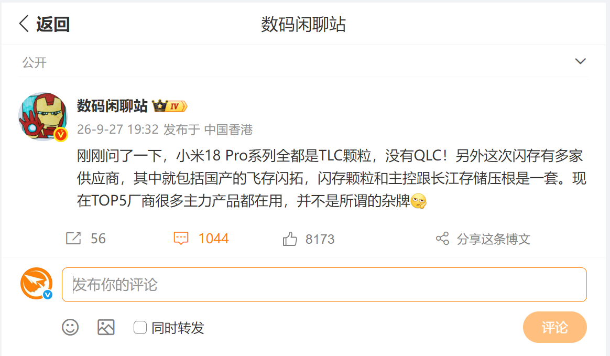
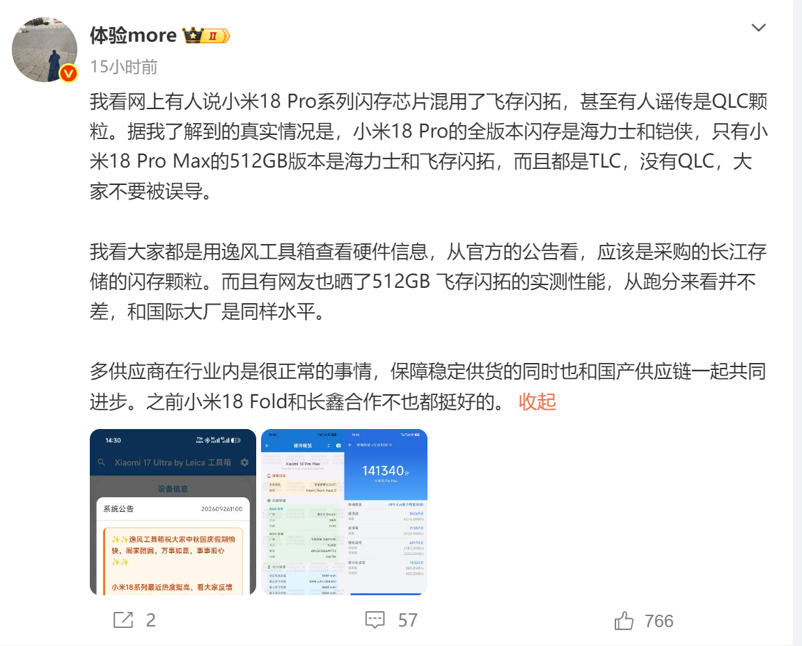
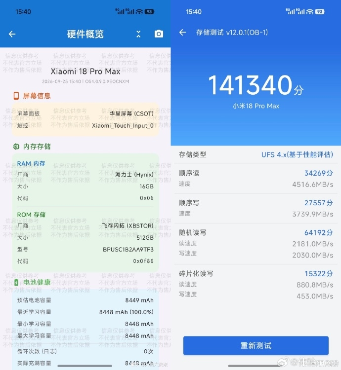

Circulaban rumores de que Xiaomi habría recortado costes en el almacenamiento
del Xiaomi 18 Pro mezclando chips QLC en algunas versiones. Una filtración
publicada en los últimos días por conocidos bloggers tecnológicos chinos y
recogida por MyDrivers
desmiente esa hipótesis: **toda la gama Xiaomi 18 Pro usa partículas de memoria
flash TLC y ninguna capacidad monta QLC**.

La noticia afecta a la ficha que muchos compradores miran antes de pagar: el tipo
de NAND que lleva un teléfono condiciona su comportamiento a largo plazo, y el
principal temor con el QLC es que aparezca justo en las capacidades altas, donde
el fabricante tiene más margen para recortar.

## TLC en todas las versiones, según la filtración

El primer aviso llegó de un conocido blogger del ecosistema chino, que aseguró
tras preguntar al respecto que «la serie Xiaomi 18 Pro lleva todas TLC, sin
QLC». En el mismo mensaje añadió que el
suministro de flash incorpora a varios proveedores a la vez, entre ellos el
fabricante nacional Feicun Shantuo (XBSTOR), cuyas partículas y controlador
pertenecen al mismo linaje tecnológico que los productos de Yangtze Memory
(YMTC), y aseguró que muchos modelos insignia de los cinco mayores fabricantes
del mundo ya la utilizan.

Un segundo filtrador aportó después el desglose por versión: el Xiaomi 18 Pro
estándar recibe flash de SK Hynix y Kioxia en todas sus capacidades, mientras
que el Xiaomi 18 Pro Max de 512 GB es el único que combina SK Hynix con
Feicun Shantuo. En ambos casos, según esa fuente, el formato es TLC y no hay
ninguna variante degradada a QLC.

## TLC frente a QLC: por qué la distinción importa

La diferencia es puramente técnica, pero tiene consecuencias prácticas. Una celda
TLC almacena tres bits de información y una QLC almacena cuatro: al guardar más
bits en el mismo espacio, el QLC permite fabricar más capacidad por euro, y por
eso se usa sobre todo para abaratar almacenamiento. El coste se paga en una
menor resistencia a los ciclos de escritura y en un rendimiento sostenido
inferior durante escrituras largas, terreno donde el TLC rinde mejor.

Por eso una filtración como esta tiene peso en una gama alta: el TLC es el formato
habitual en los buques insignia, y la sospecha de QLC aparece cuando el usuario
teme que el fabricante haya bajado el listón en la capacidad más cara. La
confirmación de que ninguna versión del Xiaomi 18 Pro usa QLC elimina esa
preocupación de la ficha técnica.

## Qué se ha medido en la práctica

Las capturas compartidas junto con la filtración corresponden a un Xiaomi 18 Pro
Max de 512 GB. La app de diagnóstico identifica la ROM como XBSTOR (Feicun
Shantuo) y la memoria de 16 GB como SK Hynix, y su prueba de almacenamiento —que
clasifica el módulo como UFS 4.x a partir de la medición del rendimiento— arroja
una lectura secuencial de 4516,6 MB/s y una escritura secuencial de 3739,9 MB/s,
con una puntuación total de 141.340 puntos.

Son valores de una sola unidad y de una herramienta de terceros, así que conviene
tomarlos como referencia orientativa y no como especificación oficial. Aun así,
encajan con el argumento de los filtradores: el proveedor nacional no se quedaría
por debajo del nivel de los fabricantes internacionales consolidados.

## Qué cambia para el comprador

En la práctica, la compra del Xiaomi 18 Pro no exige renunciar al TLC por miedo a
recibir QLC oculto, y el suministro multiproveedor (SK Hynix, Kioxia y, en el Max de
512 GB, Feicun Shantuo) da margen ante una posible escasez de un proveedor
concreto. Para el resto de la ficha —pantalla trasera, Snapdragon 8 Elite Gen 6,
batería y precios desde 5.999 yuanes— conviene revisar
[la cobertura del lanzamiento de la serie](/noticias/xiaomi-18-pro-lanzamiento/),
donde ya se detallaron cámara, autonomía y gamas disponibles.
