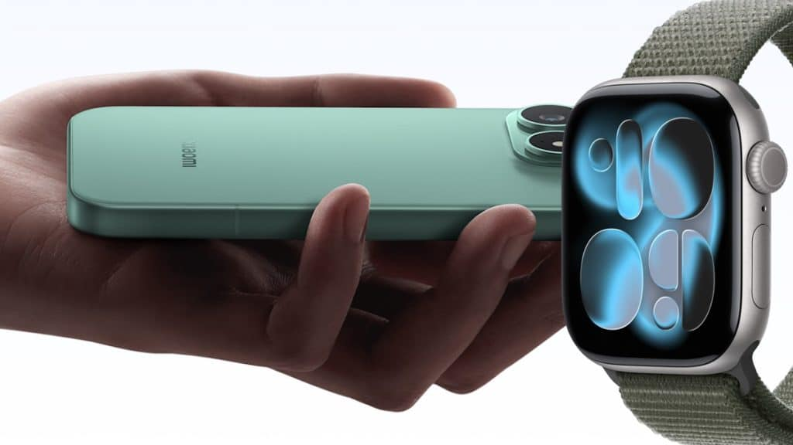

Los móviles Xiaomi con HyperOS 4 ya pueden conectarse a un Apple Watch. La compatibilidad llega de la mano de la [serie Xiaomi 18 Pro](/noticias/xiaomi-18-pro-lanzamiento/) y permite recibir llamadas, mensajes y notificaciones en el reloj de Apple, además de sincronizar los datos de salud con la aplicación Mi Fitness. Eso sí: el reloj debe haberse activado antes con un iPhone.

## Qué ha pasado

Xiaomi ha presentado la conexión entre sus teléfonos con HyperOS 4 y el Apple Watch junto a la serie Xiaomi 18 Pro, según informa Gadgets & Wearables a partir de la página de compatibilidad de la propia Xiaomi. No se trata de un simple reenvío de avisos: las llamadas, los mensajes de texto y las notificaciones de las aplicaciones del móvil aparecen en el reloj, y las actividades en directo de Super Island también se trasladan a la muñeca. En sentido contrario, la información de salud y ejercicio registrada por el Apple Watch se sincroniza con Mi Fitness.

La conexión se gestiona con la aplicación Xiaomi Connect instalada en el Apple Watch. El reloj muestra un código QR que se escanea con el móvil Xiaomi y, tras conceder los permisos correspondientes en ambos dispositivos, el enlace queda activo. También hay búsqueda bidireccional: el móvil puede hacer sonar el reloj y el reloj puede hacer sonar el teléfono.

La idea no es nueva. El propio medio recuerda que ya en diciembre de 2024 informó de que Xiaomi exploraba esta compatibilidad, y casi dos años después la función se ha materializado con HyperOS 4. La información de contraste disponible (Gizmochina, XimiTime) coincide en lo esencial: el anuncio lo hizo Lu Weibing, presidente del Grupo Xiaomi, en el evento de otoño, y los requisitos pasan por HyperOS 4.0.1 o posterior en el móvil y watchOS 11 o posterior en el reloj.

## Por qué importa

Hasta ahora, el Apple Watch era un dispositivo atado al iPhone, sin soporte oficial en Android. Que Xiaomi haya logrado tender este puente tiene relevancia por dos motivos. Primero, porque reduce el coste de cambiar de plataforma: quien pase de un iPhone a un Xiaomi puede conservar su reloj actual en lugar de verse obligado a sustituirlo. Segundo, porque se enmarca en una estrategia más amplia de Xiaomi de acercarse al ecosistema de Apple, donde ya ofrecía transferencias de archivos y conectividad con iPhone, iPad y Mac.

Con todo, conviene no exagerar el alcance. Xiaomi reconoce que algunas funciones dependen del dispositivo concreto y la compatibilidad exige modelos relativamente recientes: Apple Watch Series 6 y posteriores, Apple Watch SE de segunda generación en adelante y todos los modelos Ultra, siempre con watchOS 11 o posterior.

## Qué cambia si tienes un Apple Watch

El matiz decisivo es que el iPhone sigue siendo necesario. Xiaomi indica expresamente que el Apple Watch debe haberse emparejado y activado antes con un iPhone; no es posible comprar el reloj nuevo y enlazarlo directamente al móvil Xiaomi desde cero. La función está pensada para quien ya tiene un Apple Watch y cambia de teléfono, o para quien combina ambos ecosistemas.

Para ese perfil, el cambio es práctico: llamadas que se atienden desde la muñeca, notificaciones del móvil Xiaomi en el reloj, datos de salud reunidos en Mi Fitness y localización mutua de los dispositivos. Los relojes propios de Xiaomi siguen siendo la opción más sencilla para quien parte de cero, pero quien ya invirtió en un Apple Watch ahora tiene un motivo menos para no probar un móvil Xiaomi con HyperOS 4.
