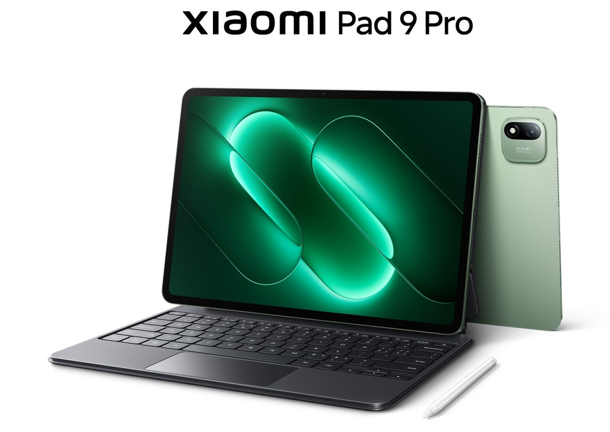
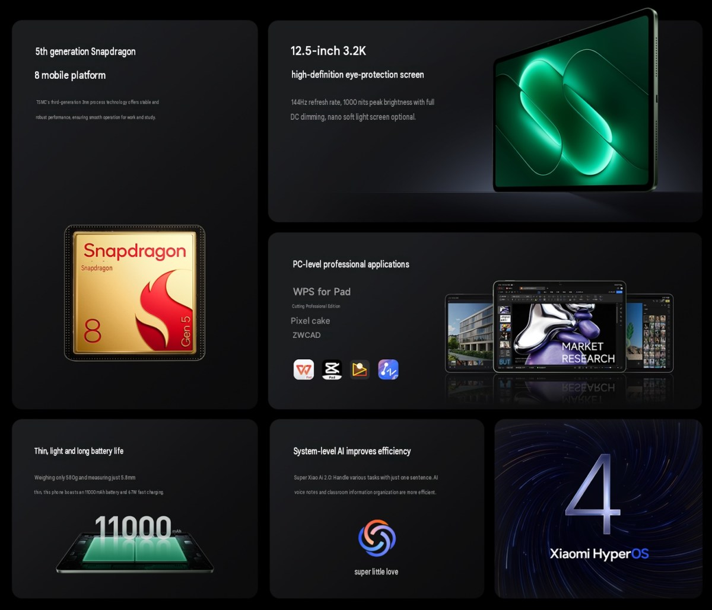
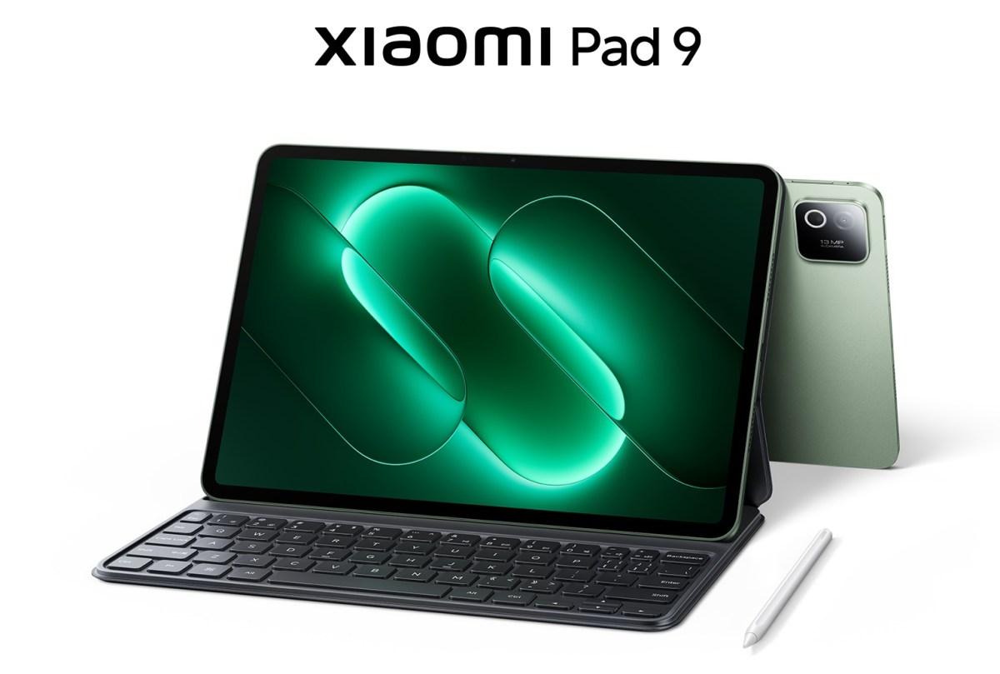
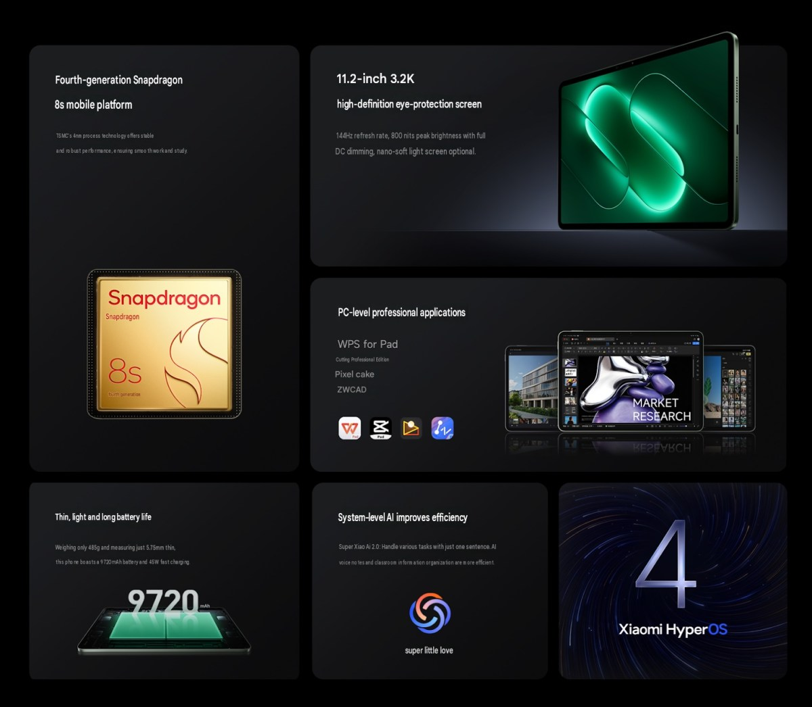
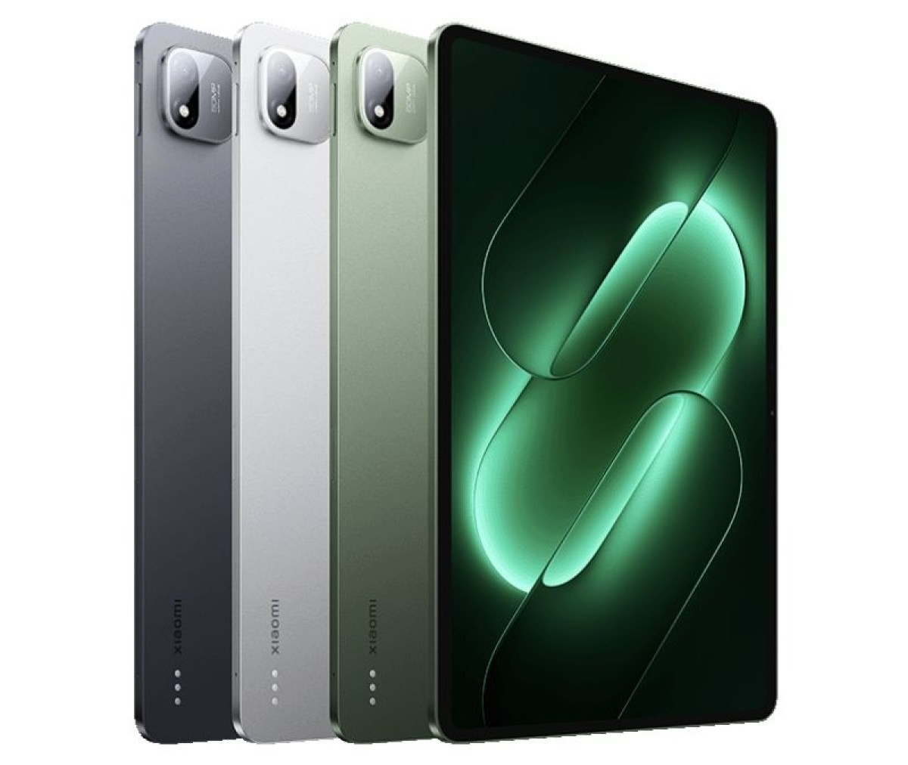
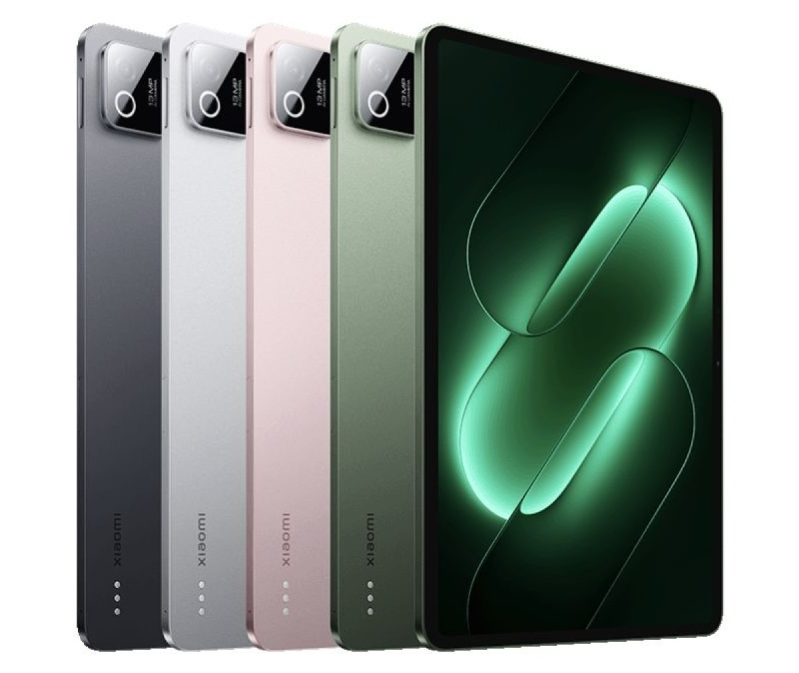

Xiaomi ha presentado en China los nuevos **Xiaomi Pad 9 Pro y Pad 9**, dos tablets que llegan para completar la familia que abrió el Pad 9 Pro Max a comienzos de mes. El anuncio se produjo junto al de los [Xiaomi 18 Pro y 18 Pro Max](/noticias/xiaomi-18-pro-lanzamiento/), de modo que la compañía renovó al mismo tiempo su catálogo de móviles y de tablets en el mercado chino. Los dos modelos comparten pantalla de alta resolución y conectividad, pero se separan en potencia, cámara y precio para cubrir dos escalones distintos.

## El Xiaomi Pad 9 Pro apunta a la gama alta

El Pad 9 Pro es el mayor de los dos, con una pantalla LCD de 12,5 pulgadas, resolución 3.2K y frecuencia de refresco de 144 Hz. Según la información del fabricante, el panel alcanza un brillo máximo de 1.000 nits y admite atenuación DC en todo el rango, un detalle pensado para reducir el parpadeo en sesiones prolongadas.

En su interior trabaja el Snapdragon 8 Gen 5, la quinta generación de la familia Snapdragon 8, acompañado de hasta 16 GB de memoria RAM y 256 GB de almacenamiento UFS 4.1. La batería asciende a 11.000 mAh, con carga rápida por cable de 67 W y carga inversa de 22,5 W para recargar otros dispositivos. La cámara trasera es de 50 MP y la delantera, de 32 MP.

El conjunto se completa con HyperOS 4 y aplicaciones de nivel de PC, como WPS, además de compatibilidad con el Xiaomi Focus Stylus y un teclado opcional. Con 5,8 mm de grosor y 580 gramos, Xiaomi lo plantea como un equipo para trabajo y estudio.

## El Pad 9 recorta precio y mantiene la pantalla 3.2K

El Xiaomi Pad 9 es algo más compacto: su panel LCD baja a 11,2 pulgadas, pero conserva la resolución 3.2K y los 144 Hz. En este caso el brillo máximo se queda en 800 nits, también con atenuación DC. El procesador es el Snapdragon 8s Gen 4, el mismo chip que utilizó el Pad 8, y las opciones de memoria y almacenamiento repiten las del modelo Pro.

La batería es de 9.720 mAh con carga de 45 W, y las cámaras pasan a 13 MP en la parte trasera y 8 MP en la frontal. El Pad 9 comparte con su hermano mayor el lector de huellas lateral, el Wi-Fi 7, el Bluetooth 6.0 y los cuatro altavoces con Dolby Atmos. Su acabado es más fino y ligero, con 5,75 mm y 485 gramos.

## Precios y disponibilidad

Ambos modelos se ponen a la venta en China. El Pad 9 Pro arranca en 3.799 yuanes (unos 565 dólares) en su versión de 8 GB y 128 GB, y escala hasta los 4.999 yuanes (unos 745 dólares) del modelo con 16 GB de RAM y 256 GB. El Pad 9 parte de 2.999 yuanes (unos 450 dólares) para la configuración de 8 GB y 128 GB.

| Modelo | Configuración | Precio | Aprox. en dólares |
| --- | --- | --- | --- |
| Pad 9 Pro | 8 GB + 128 GB | 3.799 ¥ | 565 $ |
| Pad 9 Pro | 8 GB + 256 GB | 4.099 ¥ | 610 $ |
| Pad 9 Pro | 12 GB + 256 GB | 4.599 ¥ | 685 $ |
| Pad 9 Pro | 12 GB + 256 GB (pantalla mate) | 4.799 ¥ | 715 $ |
| Pad 9 Pro | 16 GB + 256 GB | 4.999 ¥ | 745 $ |
| Pad 9 | 8 GB + 128 GB | 2.999 ¥ | 450 $ |
| Pad 9 | 8 GB + 256 GB | 3.299 ¥ | 490 $ |
| Pad 9 | 8 GB + 256 GB (Soft Light) | 3.499 ¥ | 520 $ |
| Pad 9 | 12 GB + 256 GB | 3.799 ¥ | 565 $ |

El Pad 9 Pro llega en negro, plata y verde Spruce Green, mientras que el Pad 9 añade un cuarto acabado en rosa Ice Peach Pink.

De momento, Xiaomi solo ha desglosado precios y disponibilidad para China, sin detallar una posible llegada a España o al resto de Europa. Para el comprador, la propuesta es clara: la misma pantalla 3.2K de 144 Hz en los dos modelos, con la potencia y la cámara como principales diferencias de precio.
