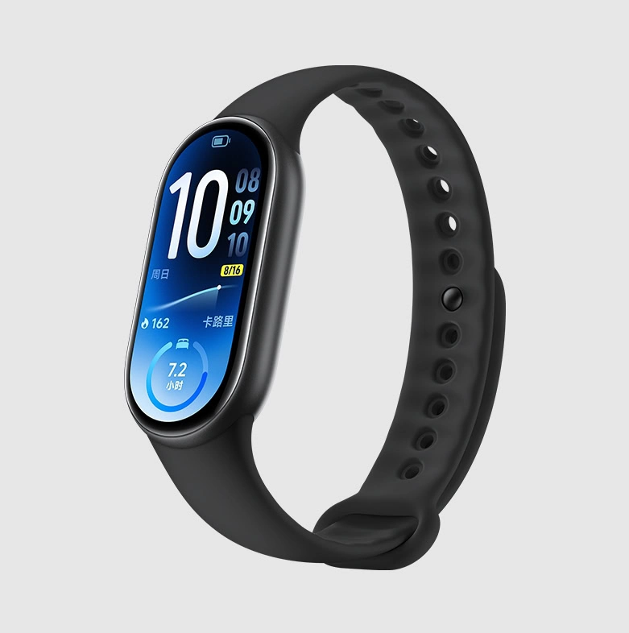
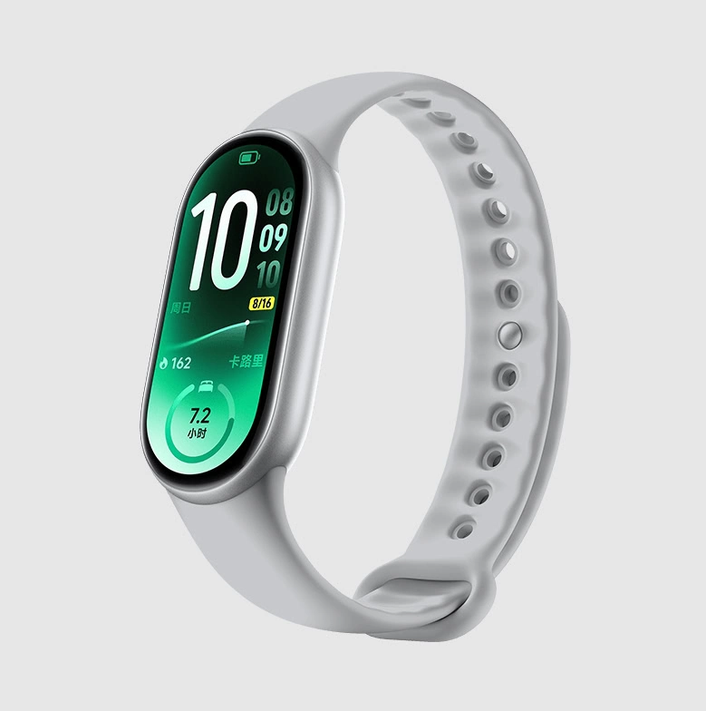
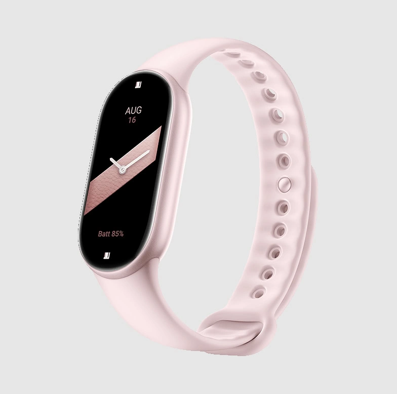
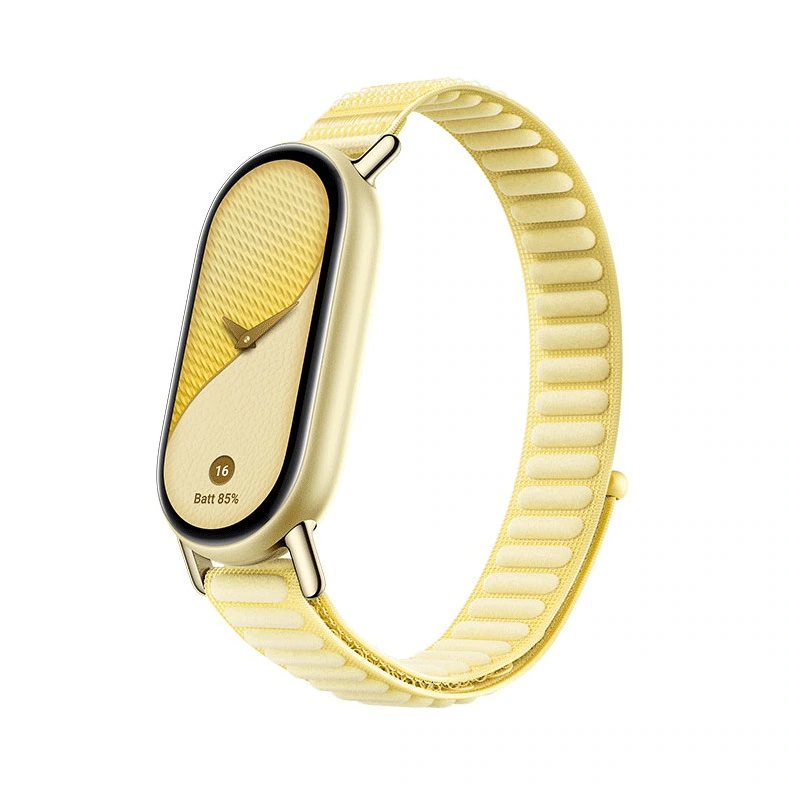

Xiaomi ha presentado en China la Smart Band 11 y el Watch S5, dos nuevos dispositivos para la muñeca con los que la compañía refuerza su apuesta por el seguimiento de la salud y el deporte. La pulsera es la protagonista de esta pieza: adelgaza respecto a la generación anterior y estrena un sensor de pulso más preciso, mientras que el reloj queda como la opción premium con una edición Transparent Edition de 47 mm.

## La Smart Band 11 adelgaza: más fina y ligera

Xiaomi describe la Smart Band 11 como su pulsera más delgada hasta la fecha. Hablamos de 9,99 mm de grosor y 15,58 gramos de peso, unas cifras que la acercan a un accesorio casi imperceptible en la muñeca. La pantalla es un panel AMOLED de 1,72 pulgadas que alcanza los 2.000 nits de brillo máximo y reduce los biseles a 2 mm, de modo que gana superficie visible sin crecer por fuera. El marco central está fabricado en aleación de aluminio con acabado arenado mate, y la correa se cambia mediante un sistema de liberación rápida.

## Salud y deporte: el salto de la Smart Band 11

El seguimiento de la salud es donde Xiaomi ha concentrado los cambios. La pulsera incorpora un sensor de frecuencia cardíaca de doble luz y doble fotodiodo (dual-PD) con un algoritmo desarrollado por la propia compañía. Eso le permite medir el pulso durante todo el día y avisar cuando detecta un ritmo anómalo. A ello se suma la medición continua de oxígeno en sangre (SpO2) y de estrés, la variabilidad de la frecuencia cardíaca (HRV) mientras se duerme y los informes de tendencias de descanso.

En el apartado deportivo reconoce más de 150 modos de entrenamiento, entre ellos carrera, ciclismo, natación, yoga y boxeo. El modo de natación añade seguimiento del pulso en tiempo real, reconocimiento de brazadas con IA y detección de postura mediante un sensor de 9 ejes; Xiaomi cifra en hasta un 95 % la precisión al registrar largos. La resistencia al agua es de 5 ATM.

## Autonomía, colores y precio

La batería de 233 mAh se carga por completo en unos 90 minutos y sostiene, según el fabricante, hasta 21 días en modo ultra prolongado, 12 días en uso normal y 7 días con la pantalla siempre encendida (AOD). La pulsera funciona con Android y iOS, y puede controlar dispositivos personales, equipos del ecosistema Mi Home y funciones compatibles del coche.

En China, la versión estándar cuesta 299 yuanes (unos 45 dólares) y la versión con NFC, 349 yuanes (unos 52 dólares). El marco se ofrece en plata, negro, oro rosa y oro amanecer.

## Qué cambia para el lector

De momento Xiaomi solo ha detallado precios y disponibilidad para China, así que quien esté interesado en comprarla en España tendrá que esperar a un anuncio global para conocer el precio en euros y la fecha de venta. Las cifras en yuanes sirven como referencia, pero no incluyen impuestos ni gastos de importación.

El Watch S5, que completa el lanzamiento, arranca en 1.299 yuanes (unos 194 dólares) en su versión de 41 mm y ofrece hasta 14 días de autonomía. Su edición Transparent Edition de 47 mm, [de la que ya hablamos en este portal](/noticias/xiaomi-watch-s5-transparent/), cuesta 2.499 yuanes.

