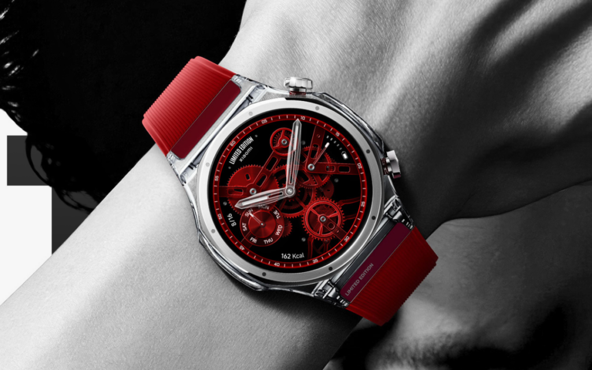
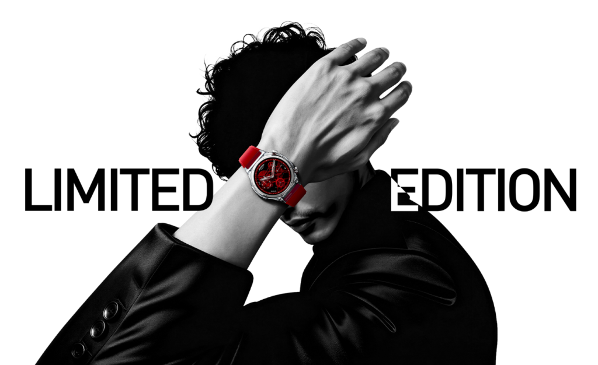
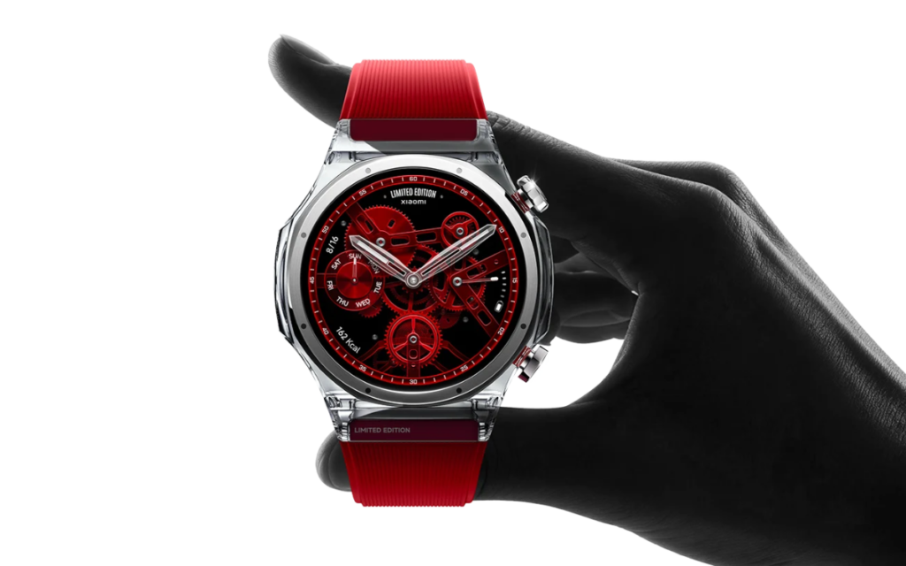

Xiaomi ha presentado el **Watch S5 Transparent Edition**, una variante de su reloj inteligente que
sustituye el aluminio, el titanio o el acero habituales por una caja de vidrio transparente. El
modelo se puso a la venta junto al Watch S5 de 41 mm y llega con una producción muy limitada: solo
**5.000 unidades**, a un precio de **2.499 yuanes** (aproximadamente 372 dólares).

## El cuerpo de cristal del Watch S5 Transparent Edition

El elemento que define a esta edición es el material de la caja. Xiaomi construye un cuerpo
octogonal de **47 mm** con un vidrio al que la compañía llama **Dragon Crystal Glass 3.0**. El
diseño deja pasar la luz por el marco central, de modo que se ven los elementos estructurales
internos del reloj. Para darle rigidez y algo de contraste visual, el fabricante integra un bisel
de acero inoxidable cepillado directamente en la carcasa de vidrio.

Usar vidrio como chasis plantea dudas razonables sobre la resistencia, ya que un reloj de muñeca
recibe golpes y roces con frecuencia. Xiaomi asegura que lo ha resuelto con una pieza única de
vidrio sometida a un proceso de fabricación largo: cada caja requiere **20 pasos distintos**, que
incluyen **240 minutos de mecanizado CNC de precisión** y **800 minutos de pulido en varias fases**
para lograr el acabado transparente. El resultado declara una dureza Vickers de **810 HV0.05**, y
la compañía sostiene que, a diferencia de los plásticos, siliconas o resinas transparentes usados
en otros productos, este vidrio no se decolora ni amarillea con el tiempo.

En el apartado de interfaz, el reloj incluye una esfera roja personalizada que imita un reloj
mecánico tradicional. Es un guiño deliberado al lenguaje de diseño de la
[edición especial transparente de la serie Xiaomi 18 Pro](/noticias/xiaomi-18-pro-lanzamiento/),
que llegó con la misma familia de acabados en el mismo ciclo de lanzamientos.

## El S5 de 41 mm, la referencia de la familia

El Watch S5 Transparent Edition no se presenta solo. En la misma tanda, Xiaomi lanzó el **Watch S5
de 41 mm**, una alternativa más pequeña al modelo de 46 mm que la marca puso a la venta a
principios de año. Ese reloj es el primero en incluir **HyperOS 4 para wearables** y una versión
renovada de la aplicación de WeChat, y sirve como referencia de las prestaciones de la familia.

Su ficha incluye una pantalla **AMOLED de 1,32 pulgadas con refresco de 60 Hz** y un brillo máximo
de **3.000 nits**. La caja mide **9,9 mm de grosor y pesa 36 gramos sin correa**, con cuerpo de
acero inoxidable, bisel de cerámica y corona texturizada. Se ofrece en negro, azul Sea Salt y
blanco cerámico.

En salud, usa un conjunto de **cuatro LED y cuatro fotodiodos** para medir frecuencia cardíaca y
oxígeno en sangre, además de **tres sensores de temperatura en la muñeca** con una precisión
declarada de **±0,1 °C**, orientados al seguimiento del ciclo menstrual y la predicción de la
ovulación. Añade monitorización **UVA y UVB de doble banda**, más de **150 modos de entrenamiento**,
GNSS de doble frecuencia, mapas sin conexión a todo color y un modo de esquí con detección de
caídas.

La batería es de **590 mAh**, con una autonomía estimada de hasta **14 días** en uso restringido,
**ocho días** con monitorización estándar y **cinco días** si se activa la pantalla siempre
encendida. El modelo de 41 mm parte de **1.299 yuanes** (unos 194 dólares) con correa de
fluoroelastómero, y sube a **1.499 yuanes** (unos 224 dólares) en la versión con correa de piel.

## Precio y qué cambia para el comprador

La edición transparente se queda, de momento, en el mercado chino y su precio en yuanes no
anticipa el que tendría en euros si Xiaomi decidiera venderla fuera. El dato relevante para el
comprador es la tirada: **5.000 unidades** convierten al reloj en una pieza de coleccionista más
que en un producto de gran consumo, y el acabado en vidrio es, a la vez, su mayor atractivo y su
principal incógnita. La compañía apela a la dureza y al proceso de fabricación para justificar la
resistencia, pero el uso real en muñeca es el que termina dictando si un chasis de cristal aguanta
el día a día sin marcas.

Para quien busque un smartwatch de Xiaomi sin ese componente experimental, el S5 de 41 mm ofrece la
propuesta convencional de la familia, con la misma base de software y una ficha de salud y
autonomía ya conocida. La edición transparente, en cambio, apunta a quien valora el diseño por
encima de la disponibilidad y no le importa pagar más por un objeto de serie corta.
