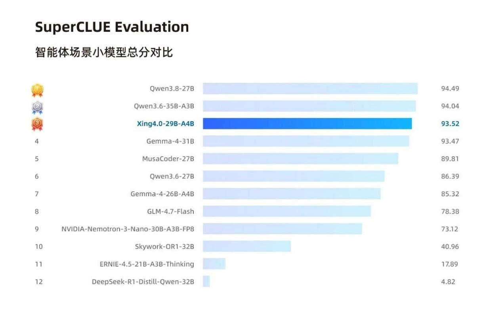
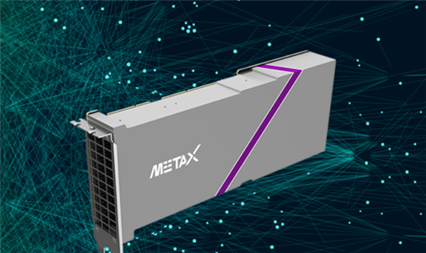

La filial de inteligencia artificial de China Telecom presentó su nueva generación de modelo Xingchen, el **Xing4.0-29B-A4B**, y MetaX ha respondido de inmediato: según anunció la compañía, su GPU de la serie **Xiyun C** es la primera en completar la adaptación «Day 0» del modelo, es decir, disponible desde el mismo día de su puesta en circulación. El soporte llega a través de **MXMACA**, la pila de software desarrollada por el propio fabricante.

## Un modelo ligero pensado para agentes

El Xing4.0-29B-A4B se describe como un modelo ligero de código orientado a la era de los agentes. Emplea una arquitectura **MoE** (mezcla de expertos) con 29 000 millones de parámetros totales, de los que solo 4000 millones se activan en cada operación. Admite de forma nativa un contexto de 256K tokens, ampliable hasta 512K.

Según la información publicada, se trata del primer gran modelo de decenas de miles de millones de parámetros entrenado íntegramente con cómputo y framework de origen chino, y está optimizado para tareas de ingeniería complejas: planificación de tareas, invocación de herramientas y ejecución autónoma.

En las pruebas citadas, el modelo obtiene 75,0 puntos en SWE-bench Verified y 57,5 en Terminal-Bench 2.1, por encima de competidores de tamaño similar. En la evaluación de capacidades de agente de SuperCLUE alcanza 93,52 puntos, lo que lo sitúa en tercera posición y a menos de un punto de dos modelos Qwen de referencia.

## Qué aporta la pila MXMACA

El trabajo de adaptación se apoya en MXMACA, que cubre toda la cadena: controladores de bajo nivel, el compilador MXCC, la adaptación profunda de operadores y la conexión con los principales frameworks de entrenamiento e inferencia. MetaX sostiene que este enfoque reduce un ciclo de adaptación que tradicionalmente lleva semanas a una cuestión de horas.

La compañía afirma además que MXMACA ya es compatible con más de 40 frameworks de inteligencia artificial y más de 1000 modelos, con soporte completo para los 2410 operadores de GPU de PyTorch 2.8. Desde diciembre de 2025, MetaX dice haber completado la adaptación «Day 0» de 38 modelos destacados, entre ellos desarrollos de Zhipu AI, Alibaba Qwen, MiniMax, DeepSeek, StepFun y Tencent Hunyuan.

## Qué cambia para el lector

Más allá del anuncio corporativo, el dato relevante está en el consumo de recursos: tras una cuantización a 4 bits, el modelo reduce su ocupación de memoria de vídeo a unos **15 GB**. Eso significa que tarjetas gráficas de consumo como la RTX 3090 o la RTX 4090 podrían ejecutarlo en local.

Para el usuario hispanohablante, la noticia interesa por dos motivos. Por un lado, muestra el ritmo al que el ecosistema chino de cómputo intenta despegarse de las plataformas dominantes, con software propio como principal palanca. Por otro, anticipa modelos de agentes cada vez más compactos capaces de correr en hardware que muchos ya tienen en casa, sin depender de la nube. Queda por ver si esa adaptación «Day 0» se traduce en un rendimiento real equiparable al de las soluciones consolidadas.
