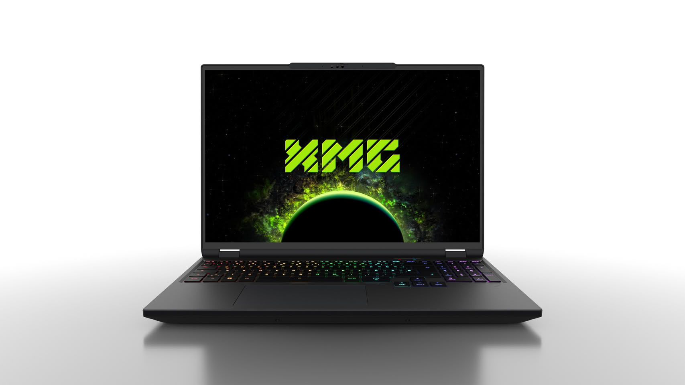
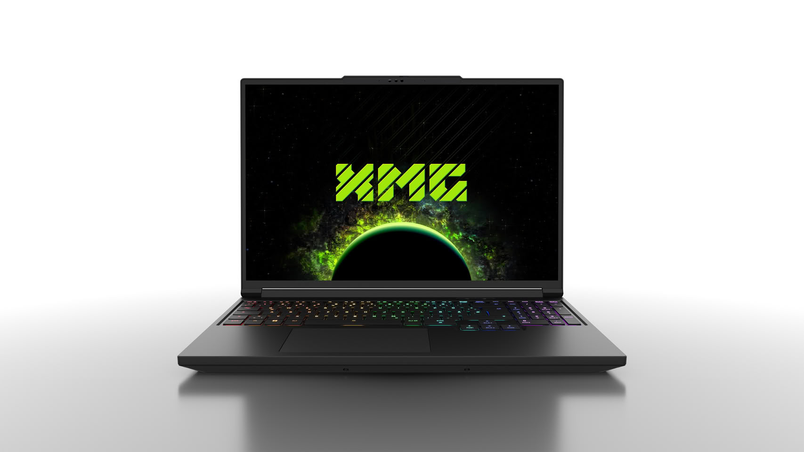

XMG ha presentado la actualización para 2026 de sus portátiles de 16 pulgadas de las series APEX y PRO. Los nuevos APEX 16 y PRO 16 VE llegan con una NVIDIA GeForce RTX 5070 de 12 GB de VRAM, una configuración que sustituye a la generación anterior, donde la misma GPU se ofrecía con solo 8 GB. Además del cambio de memoria gráfica, la compañía ha retocado el sistema de refrigeración y la ventilación inferior de ambos equipos, según el comunicado oficial de la compañía.

## Dos plataformas, una misma GPU

El XMG APEX 16 (M26) se apoya en AMD. El usuario puede elegir entre el Ryzen 9 9955HX, de la familia Fire Range, o el Ryzen 9 8945HX, de la generación Dragon Range refrescada; ambos con 16 núcleos y 32 hilos. La gráfica es la mencionada RTX 5070 de 12 GB, con una potencia gráfica máxima de 115 vatios incluido Dynamic Boost. El modelo MAX del año pasado, que monta una RTX 5070 Ti, se mantiene en catálogo como la opción de gama alta de 16 pulgadas.

La pantalla es un panel IPS de 2.560 x 1.600 píxeles con 300 Hz, 500 nits y cobertura del 100 % de los espacios sRGB y DCI-P3. Solo el APEX 16 MAX ofrece además la opción de un panel Mini-LED. En memoria, el APEX 16 admite hasta 96 GB de DDR5-5600 con el Ryzen 9 9955HX, o hasta 96 GB de DDR5-5200 con el 8945HX. Sus dos ranuras M.2 cuentan con escudos térmicos y almohadillas, y la principal va por PCI Express 5.0.

El PRO 16 VE (M26) comparte la RTX 5070 de 12 GB y los 115 vatios de potencia gráfica, pero se apoya en Intel. Mantiene el Core i9-14900HX, con 24 núcleos (8 de rendimiento y 16 de eficiencia) y 32 hilos. El modelo M25 anterior sigue a la venta con la RTX 5070 Ti y la RTX 5060, mientras se liquidan las últimas unidades de la RTX 5070 de 8 GB. La pantalla repite las mismas cifras: 2.560 x 1.600, 300 Hz, 500 nits y cobertura completa de sRGB y DCI-P3.

## Refrigeración revisada y más potencia sostenida

La principal novedad interna es un tercer ventilador dedicado a refrigerar la RAM, que en el APEX 16 obliga a añadir ranuras de ventilación en una carcasa inferior rediseñada. En el PRO 16 VE, ese mismo ventilador también ayuda a enfriar los heat pipes del sistema compuesto. Como el conjunto se ha adaptado a una GPU de menor consumo (115 vatios frente a los 140 del modelo MAX), el APEX 16 baja ligeramente de peso hasta los 2,35 kg con su batería de 99,8 Wh, y mantiene unas dimensiones de 356,7 x 253,8 x 26 mm.

En el PRO 16 VE el resultado es un aumento de la potencia total del sistema: 195 vatios combinados entre CPU y GPU en el M26, frente a los 180 vatios de la versión anterior, lo que debería traducirse en un rendimiento más estable bajo carga sostenida. Sus medidas son 356,7 x 252,5 x 26,5 mm y también pesa 2,35 kg con la misma batería. Admite dos SSD M.2 de hasta 16 TB por PCIe 4.0 y hasta 128 GB de DDR5 en dos zócalos SO-DIMM, a 5.200 o 5.600 MT/s según los módulos.

La conectividad es idéntica en ambos modelos: HDMI 2.1, Mini DisplayPort 2.1 compatible con DP40, dos USB-C 3.2 Gen 2 con DisplayPort 1.4a y Power Delivery, tres USB-A 3.2 Gen 1, Ethernet de 2,5 Gb, lector de tarjetas SD Express de tamaño completo y jack de audio 2 en 1. La webcam es Full HD con tapa de privacidad física. La diferencia está en el inalámbrico: el APEX 16 se queda en Wi-Fi 6E y el PRO 16 VE sube a Wi-Fi 7. Gracias a las salidas de vídeo, cualquiera de los dos puede mover hasta cuatro monitores externos además del panel interno, con el Mini DisplayPort y el HDMI conectados directamente a la GPU NVIDIA y los USB-C pasando por Optimus.

## Precios y disponibilidad

Las dos máquinas parten de 2.399 euros (IVA alemán del 19 % incluido) en bestware.com. El APEX 16 base combina el Ryzen 9 8945HX, la RTX 5070 de 12 GB, 32 GB de DDR5-5200 en dos módulos, un SSD de 1 TB y el panel IPS de 300 Hz; pasar al Ryzen 9 9955HX cuesta 125 euros más. El PRO 16 VE arranca con el Core i9-14900HX, la misma GPU, 32 GB de DDR5-5600, 1 TB de almacenamiento y la pantalla de 300 Hz por el mismo precio. Ambos ya se pueden pedir y se envían, y hasta el 21 de septiembre hay un 5 % de descuento por reserva anticipada.

Para el comprador hispanohablante, el dato relevante es la VRAM. Pasar de 8 a 12 GB en la RTX 5070 de portátil no cambia el número de fotogramas por sí solo, pero sí ayuda a evitar cuellos de botella en texturas y efectos a 1.600p, y da más margen a cargas de trabajo locales de IA. El otro punto interesante es la refrigeración: XMG reconoce que estos chips son calientes, y añadir un ventilador para la RAM y más rejillas es una respuesta directa a la crítica más repetida en foros sobre las temperaturas y el ruido bajo carga. Habrá que ver si el nuevo diseño lo consigue, pero al menos apunta en la dirección correcta.
