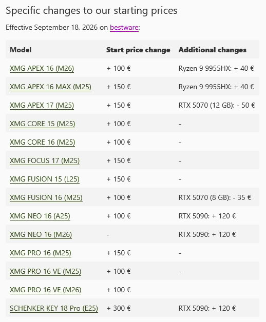
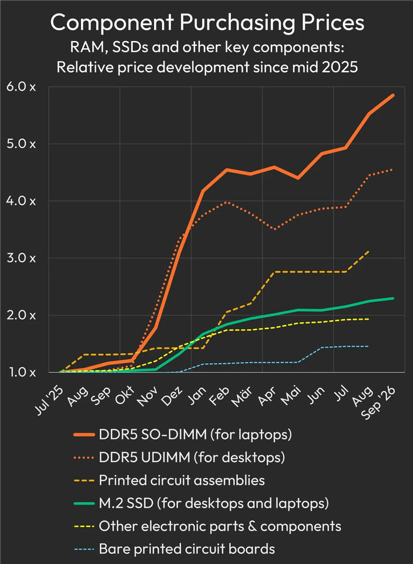

XMG ha anunciado una nueva ronda de subidas de precio para sus portátiles, la mayoría de entre 100 y 150 euros, que ya está en vigor desde el 18 de septiembre en su tienda bestware. El fabricante alemán atribuye el ajuste al encarecimiento de los componentes y señala que el coste de los módulos DDR5 SO-DIMM para portátiles se ha multiplicado casi por seis respecto a mediados de 2025. La medida afecta tanto a los equipos de la marca XMG como a varios modelos de su matriz SCHENKER.

## Qué modelos de XMG suben y cuánto

La subida más habitual es de 100 euros y alcanza al APEX 16, el CORE 15, el CORE 16, el FUSION 16 y los PRO 16 VE. Suben 150 euros el APEX 16 MAX, el APEX 17, el FOCUS 17, el FUSION 15 y el PRO 16. El mayor ajuste individual es el del SCHENKER KEY 18 Pro, con 300 euros más.

No todo son incrementos de precio base. XMG también ha encarecido 120 euros el salto a la GeForce RTX 5090 en el NEO 16 y en el SCHENKER KEY 18 Pro, y ha aplicado un recargo de 40 euros al procesador Ryzen 9 9955HX en las configuraciones del APEX 16. En sentido contrario, la actualización a la RTX 5070 se ha abaratado ligeramente en un par de modelos, aunque la compañía aclara que el coste total del sistema sigue siendo superior al anterior. Los EVO, SCHENKER CONNECT, ELEMENT y SCHENKER WORK quedan fuera de este ajuste.

## Por qué suben los precios: no solo es la memoria

La memoria sigue siendo el factor principal. XMG cifra la subida de compra de los módulos SO-DIMM DDR5 en cerca de un 600 % desde julio de 2025, un dato que la empresa contrasta con Geizhals, la plataforma de seguimiento de precios minoristas que se usa como referencia en el mercado alemán. Los módulos DDR5 para equipos de sobremesa y los SSD han seguido una trayectoria parecida.

El problema, sin embargo, ya no se limita al almacenamiento. Según XMG, los chips gráficos, la memoria de vídeo GDDR7, los procesadores para portátil de Intel y AMD y las placas de circuito impreso también cuestan más. A esto se suma el transporte: el encarecimiento del combustible y los costes de seguro del flete marítimo a través del mar Rojo y el canal de Suez, además del mayor precio del transporte aéreo. La compañía sostiene que el ajuste responde a los costes y no a una ampliación de márgenes, y se compromete a bajar los precios si los componentes vuelven a abaratarse.

## Qué cambia para el comprador

Más allá del precio, XMG advierte de que algunas configuraciones de CPU, GPU y memoria pueden sufrir plazos de entrega más largos o desabastecimientos temporales en las próximas semanas. Es la letra pequeña que conviene leer antes de encargar un equipo a medida: el catálogo se mantiene, pero la disponibilidad concreta de cada combinación puede variar.

El movimiento de XMG encaja con el escenario que ya anticipó el consejero delegado de Acer, Jason Chen, quien advirtió de que los precios de los PC podrían subir entre un 5 % y un 20 % más en el cuarto trimestre de 2026, con un pico previsto hacia mediados de 2027. En paralelo, la presión sobre la memoria gráfica sigue creciendo, con la retirada de módulos GDDR7 de 2 GB por parte de Micron, según recoge TechRadar.

Para quien tenga previsto comprar un portátil, el consejo práctico no cambia demasiado respecto a las últimas semanas: si el equipo es urgente, conviene comparar configuraciones y no dar por hecho que esperar saldrá más barato. El propio XMG no espera que los costes de los componentes bajen a corto plazo. Quien quiera entender el contexto más amplio de la escalada de precios puede repasar cómo [Acer minimiza la duración de la escasez](/noticias/acer-ceo-ram-crisis/) o la reciente [renovación del APEX 16 y el PRO 16 VE](/noticias/xmg-apex-16-pro-16-rtx-5070/) del mismo fabricante.
