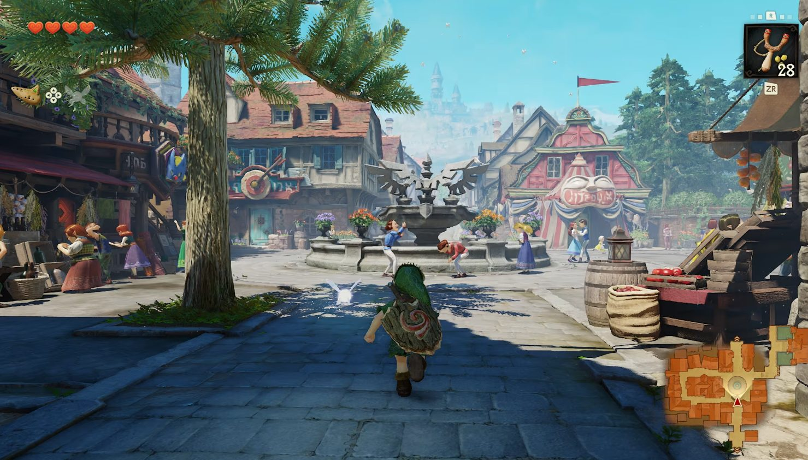
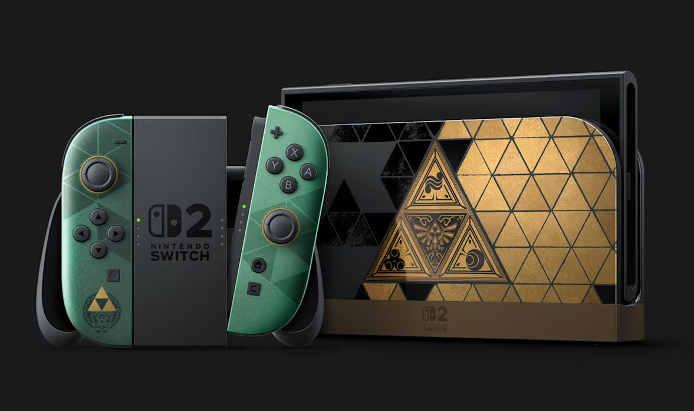
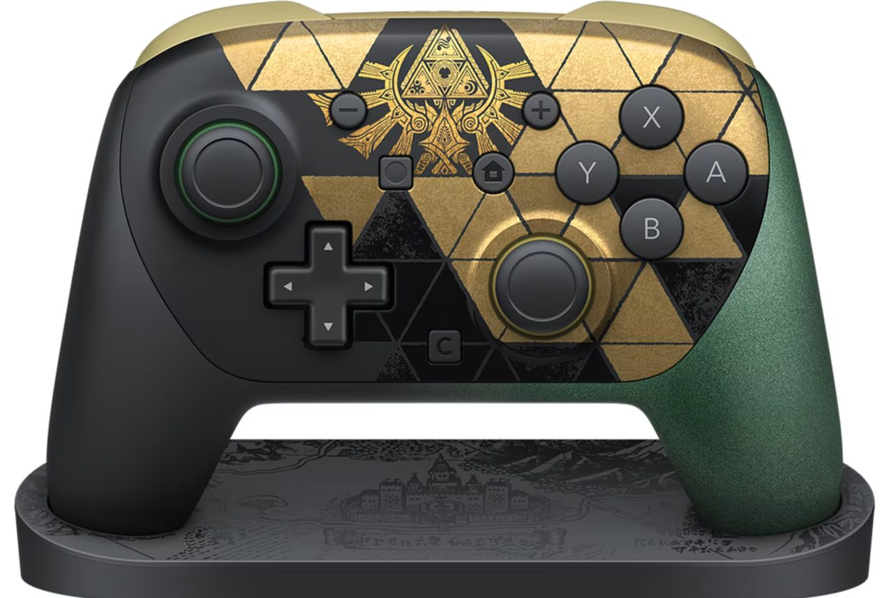
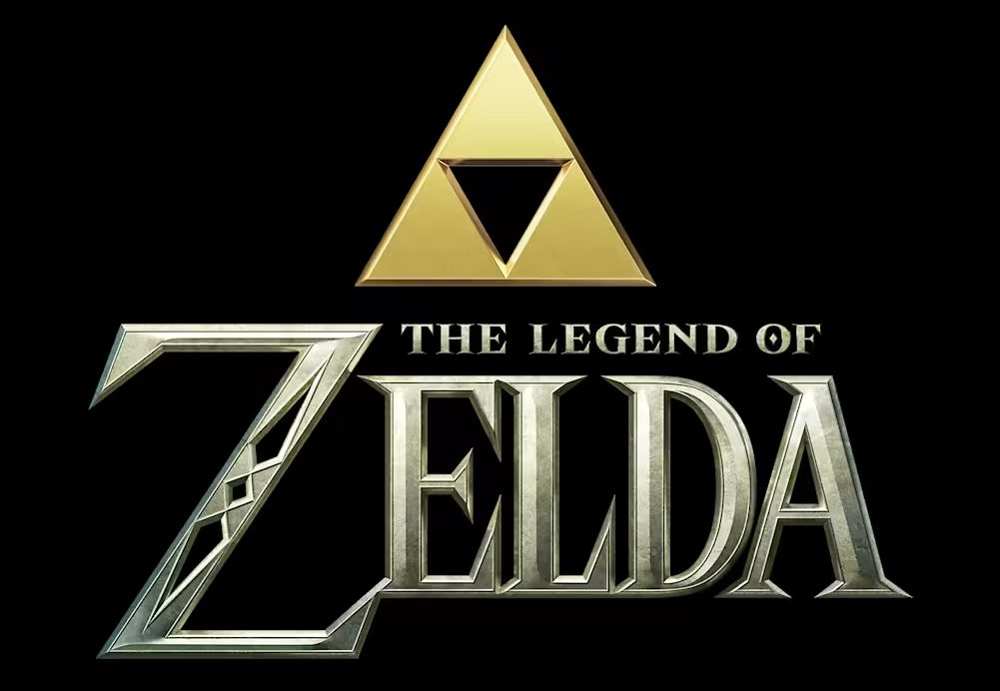

Nintendo ha convertido el 40.º aniversario de *The Legend of Zelda* en un desembarco de novedades. La compañía japonesa celebró anoche un nuevo Nintendo Direct en el que desveló la disponibilidad y los precios de un paquete conmemorativo que abarca desde el regreso de uno de sus títulos más influyentes hasta una consola tematizada, accesorios y una película de acción real. El anuncio llega en un momento dulce para la franquicia, que cumple cuatro décadas convertida en una de las licencias más reconocibles del videojuego.

## Ocarina of Time vuelve con un remake fiel

La pieza central de la celebración es el remake de *Ocarina of Time*, que llegará a Switch 2 el próximo 5 de noviembre. Se trata de una revisión que respeta la fórmula del original de 1998 —las mismas mazmorras, la misma estructura y el mismo sistema de combate con fijación de objetivos— pero que renueva por completo el apartado visual, con entornos mucho más detallados y añadidos propios de la época actual, como controles de cámara y un botón de salto. También incorpora doblaje, aunque sin reinterpretar el tono de la obra como sí hizo *Breath of the Wild*.

Durante la presentación pudieron verse escenarios emblemáticos como el Bosque Kokiri, el Campo de Hyrule y la Ciudadela de Hyrule, además de Epona, la yegua de Link. Para quienes no jugaron al original, Nintendo ha introducido un registro de misiones en el menú que recuerda el progreso y el siguiente objetivo, un guiño pensado para los jugadores que llegaron a la saga con las entregas modernas. El juego costará 59,99 dólares en formato digital y 69,99 dólares en físico.

## Switch 2, mando y accesorios con la marca Zelda

Junto al juego, Nintendo ha confirmado la *Switch 2 – The Legend of Zelda – 40th Anniversary Edition*, una edición especial que no modifica el hardware pero sí su acabado. Los Joy-Con 2 lucen en verde con detalles dorados y motivos de la saga, mientras que la base muestra el símbolo de la Trifuerza. La consola se venderá en una caja conmemorativa y su precio será de 519 dólares, apenas 20 dólares más que el modelo estándar tras la última subida.

La edición incluye además un mando Switch 2 Pro Controller personalizado, que también podrá comprarse por separado por 99 dólares. A ello se suma una funda conmemorativa con protector de pantalla y un paño de limpieza verde por 39,99 dólares. Tanto el mando como la funda llegarán el 29 de octubre, la misma fecha en la que arrancan las entregas de la consola especial en algunos minoristas.

## La película de acción real apunta a 2027

El otro gran anuncio de la velada fue la película de acción real de Zelda, desarrollada junto a Columbia Pictures. El filme contará una historia original inspirada en los 40 años de trayectoria de la franquicia y tiene previsto su estreno para el 30 de abril de 2027. Su título será simplemente *The Legend of Zelda*, sin subtítulo, una decisión que Shigeru Miyamoto justificó precisamente por ese carácter original y no adaptativo. El avance mostrado no incluyó imágenes, algo que decepcionó a parte de los seguidores, y Nintendo remitió a su aplicación Nintendo Today para futuras actualizaciones.

## Qué significa para el jugador

Más allá del componente nostálgico, el movimiento de Nintendo deja una lectura clara: la compañía quiere rentabilizar el tirón de Zelda sin arriesgar en lo creativo. Un remake fiel reduce el riesgo de decepcionar a los veteranos y, a la vez, sirve como puerta de entrada para quienes nunca tocaron el original. La parte menos agradable vuelve a ser la de siempre: los revendedores ya están ofreciendo copias físicas del juego por unos 150 dólares y la edición especial de la consola por cifras que oscilan entre los 730 y los 900 dólares. Comprar al precio oficial no es solo una cuestión de bolsillo, sino la forma más eficaz de que este tipo de prácticas no se consolide.
