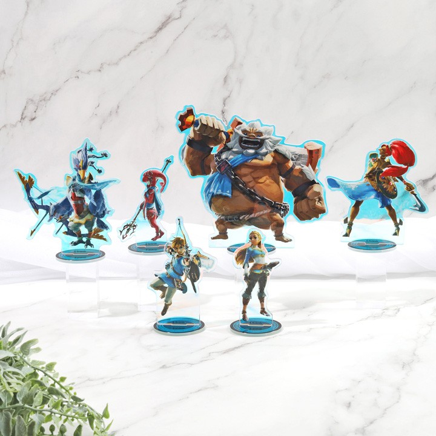
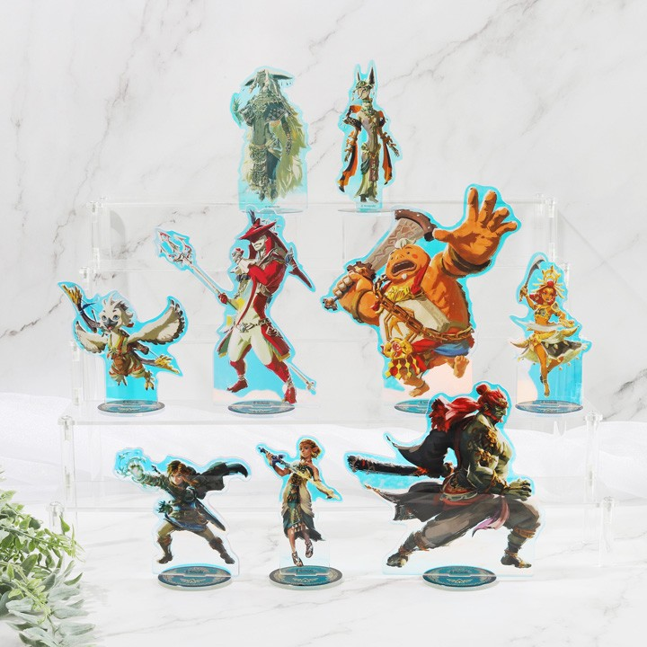
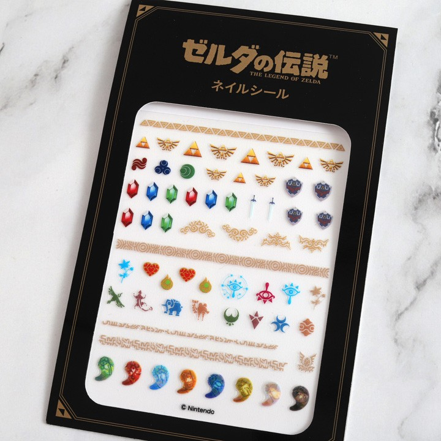
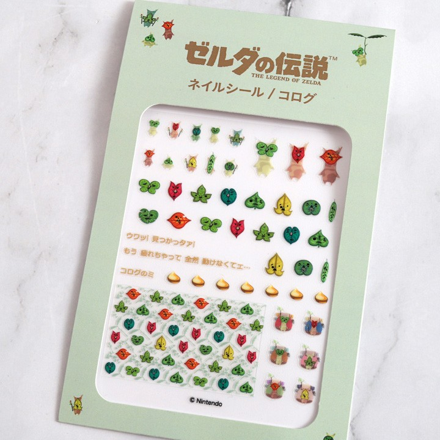
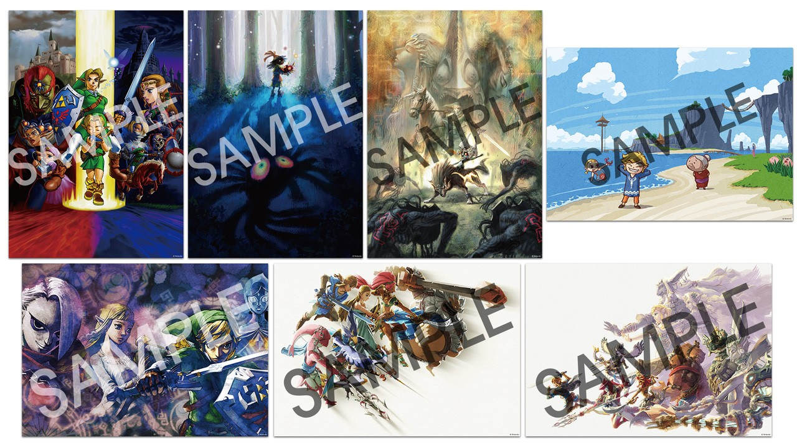
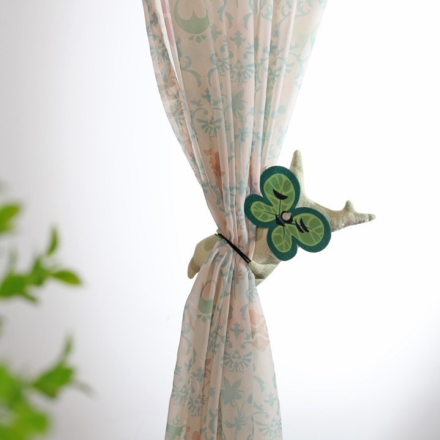
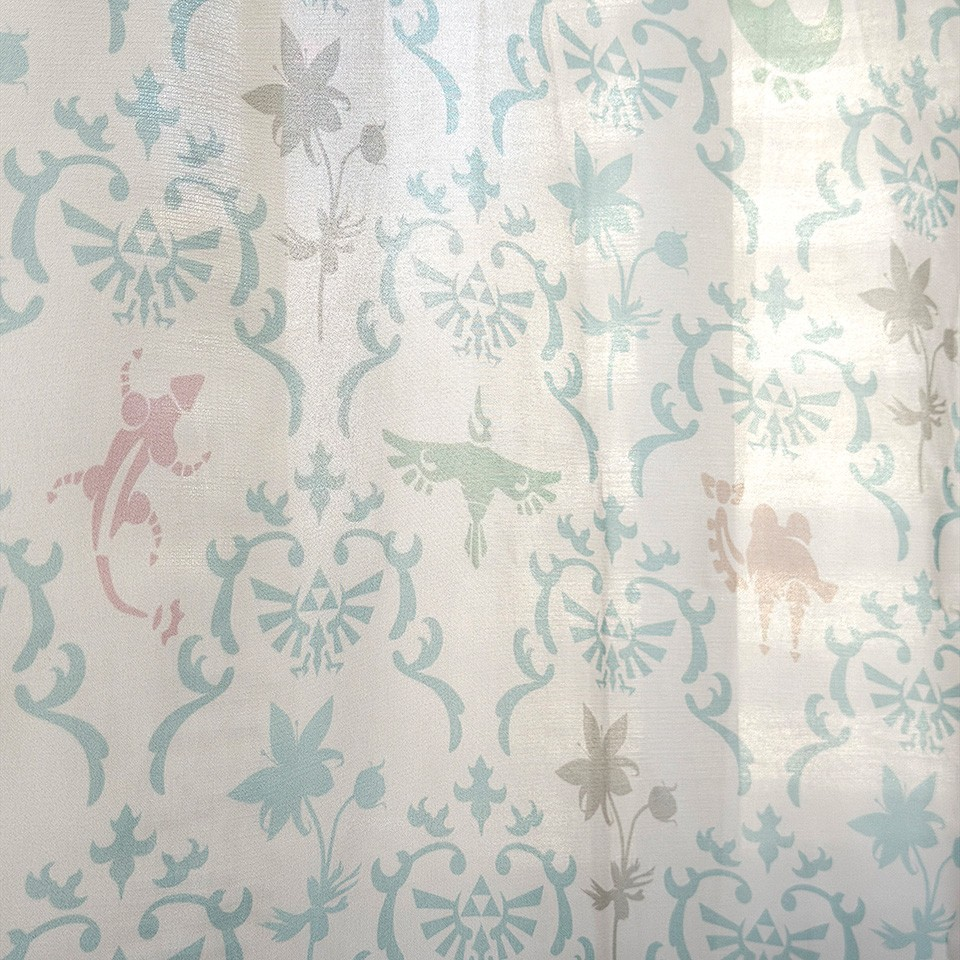
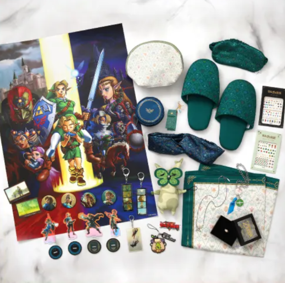
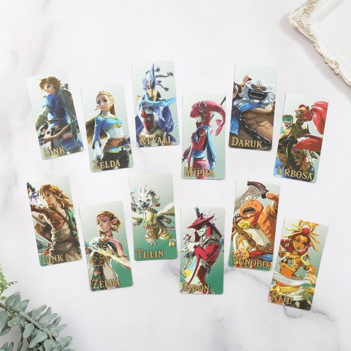
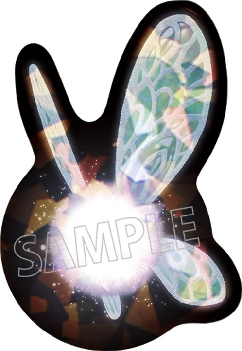

Nintendo ha anunciado una oleada de merchandising oficial de *The Legend of Zelda*: alrededor de 70 productos nuevos que estarán disponibles en las tiendas Animate de todo Japón a partir del 2 de octubre de 2026. La colección abarca desde soportes acrílicos y pegatinas para uñas hasta pósteres, cortinas y zapatillas de estar por casa. El movimiento llega en plena celebración del 40.º aniversario de la saga, que también traerá de vuelta el [remake de Ocarina of Time para Nintendo Switch 2](/noticias/zelda-40-aniversario/).

## Qué incluye la colección de Zelda

El catálogo combina piezas de coleccionista con artículos para el hogar. Entre los primeros destacan los soportes acrílicos Aurora, con 6 diseños de *Breath of the Wild* y 9 de *Tears of the Kingdom* a 2.200 yenes cada uno, con un acabado iridiscente que cambia de color según el ángulo desde el que se miren.

Las pegatinas para uñas se venden en 2 diseños a 990 yenes cada uno, con motivos de la saga como la Trifuerza, la Espada Maestra y varios kolog. La colección de pósteres ofrece 7 diseños a 1.100 yenes cada uno, en tamaño B2 (515 × 728 mm) y con ilustraciones de distintos juegos de la franquicia.

Para el hogar, la línea incluye un sujeta cortinas con forma de kolog por 2.420 yenes y una cortina de aproximadamente 108 × 178 cm con diseño inspirado en *Breath of the Wild* por 5.500 yenes. Ese mismo estampado textil se extiende a otros complementos: antifaz (1.540 yenes), neceser para accesorios (3.080 yenes), estuche tipo concha (1.980 yenes), pañuelo (2.200 yenes), turbante para el pelo (1.980 yenes), estuche para pintalabios (2.860 yenes) y zapatillas de estar por casa (2.750 yenes).

Además de estos productos originales, Animate pondrá a la venta otros artículos licenciados de *The Legend of Zelda*.

## Campaña Animate Fair y disponibilidad

La venta se enmarca en el Animate Fair, que se celebrará del 2 de octubre de 2026 al 11 de enero de 2027. Por cada 5.500 yenes gastados en productos participantes —merchandising, CD, libros y videojuegos relacionados con la saga—, los clientes recibirán un set de 6 marcapáginas, con 2 diseños posibles. En las tiendas físicas se podrá elegir el diseño; en la tienda online, no, por el proceso de envío. Los regalos estarán disponibles hasta agotar existencias.

En paralelo habrá una campaña con registro GPS: quienes compren productos participantes en una tienda Animate y hagan check-in mediante la aplicación para móviles Nintendo Store recibirán una pegatina troquelada de Navi, inspirada en su aparición en *Ocarina of Time*, con acabado holográfico.

## Qué cambia para el lector en España

De momento, el anuncio se limita a Japón: las tiendas Animate participantes están en territorio japonés y el registro GPS exige además una cuenta Nintendo con país o región configurado como Japón, con un máximo de un check-in por cuenta y día. No hay confirmada una distribución equivalente en Europa, así que quien quiera estas piezas desde España dependerá de la tienda online de Animate —sin posibilidad de elegir el diseño de los marcapáginas— o de importadores. Nintendo no ha indicado si la colección llegará a su tienda oficial europea.
