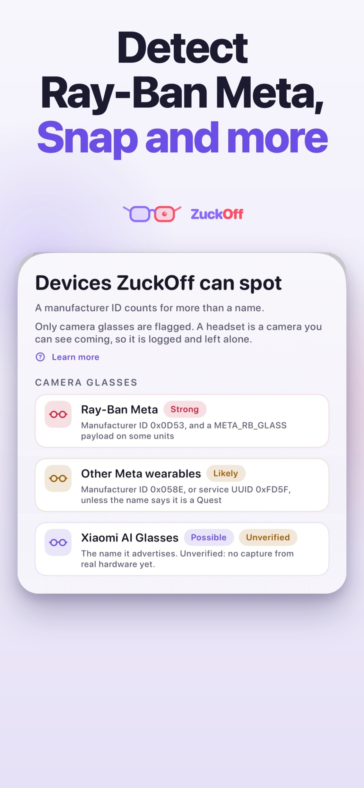

Una aplicación gratuita llamada **ZuckOff** escucha los anuncios que las gafas con cámara emiten por Bluetooth y avisa cuando detecta una cerca. El proyecto, obra del desarrollador Pawel Szydlowski, reconoce modelos como las Ray-Ban Meta, las Oakley Meta y las Snap Spectacles. Su valor no está en la detección en sí, sino en algo menos habitual en el sector: la app no pretende confirmar que alguien esté grabando, y su autor lo repite cada vez que explica cómo funciona.

En un mercado donde las gafas inteligentes ganan peso y la regulación todavía va por detrás, la propuesta de ZuckOff es deliberadamente modesta: no vende una alarma contra espías, vende información sobre qué dispositivos hay alrededor. Esa honestidad técnica es, precisamente, la parte que la distingue.

## Cómo detecta ZuckOff unas gafas que no puede ver

Los dispositivos Bluetooth se anuncian solos, y ZuckOff compara esos anuncios con un catálogo de firmas de fabricante. La app trabaja con identificadores concretos: `0x0D53` para Luxottica, que cubre las Ray-Ban Meta y las Oakley Meta; `0x058E` para los wearables de Meta Platforms Technologies; `0x03C2` para las Snap Spectacles, y el UUID de servicio `0xFD5F` registrado a nombre de Oculus VR. También reconoce nombres de producto como Spectacles, HeyCyan o VistaView, aunque con menor confianza.

Cada coincidencia se clasifica como **posible**, **probable** o **fuerte**, y la app muestra exactamente qué dato provocó el aviso. Ese detalle es importante: permite discutir el resultado en lugar de aceptarlo a ciegas. Los cascos reciben un trato distinto. Quest y Vision Pro aparecen en el registro pero nunca se marcan, porque, en palabras del propio listado, "un casco es una cámara que ves venir".

## Lo que la app no puede saber: grabar o no grabar

La limitación central es también el mensaje central. ZuckOff no puede decir si alguien está grabando, y el desarrollador lo advierte en las dos direcciones. Las gafas se anuncian con más intensidad cuando se encienden, cuando se emparejan o cuando salen del estuche; un par ya vinculado al teléfono de su dueño puede quedarse en silencio. Por lo tanto, que la app no marque nada tampoco demuestra que nadie esté filmando.

Tampoco hay dirección. La intensidad de la señal solo ofrece una distancia aproximada, que la app presenta como franjas de proximidad en lugar de una flecha, "porque una flecha sería inventada". Conviene ser preciso con lo que esto significa: ZuckOff es un detector de dispositivos con cámara, no un detector de grabaciones. Para el lector que teme una grabación no autorizada, esa diferencia no es un matiz menor: es toda la diferencia entre una herramienta útil y una falsa sensación de seguridad.

## Precio, privacidad y qué cambia para el usuario

El escaneo es gratuito mientras la app está abierta en pantalla. **ZuckOff Pro** cuesta 9,99 dólares al año en Estados Unidos, con la primera semana gratis, o 24,99 dólares en un pago único por licencia vitalicia. La versión de pago añade funciones para cuando el usuario no está mirando el móvil: vigilancia en segundo plano, alertas, un widget de pantalla de inicio, historial de avistamientos más allá de las 24 horas y exportación a CSV.

Ese salto —de mirar la pantalla a que la app vigile sola— es el que convierte el inventario en una herramienta de uso continuo. En cuanto al tratamiento de datos, el registro permanece en el dispositivo, sin cuenta ni analíticas, y no se envía nada salvo que el usuario decida reportar un dispositivo desconocido para que se añada al catálogo. La app es independiente y aclara que no tiene relación con Meta, Luxottica, Ray-Ban, Oakley ni Snap.

El contexto explica el interés: según IDC, las gafas inteligentes ya concentran cerca del 85 % de los envíos de XR, y las Snap Specs, por ejemplo, incorporan traducción en directo a 60 idiomas además de sus propias cámaras. La [expansión del mercado de gafas inteligentes](/noticias/smart-glasses-market-doubles-meta/) hace que cada vez sea más probable cruzarse con una. En paralelo, algunos países ya discuten restricciones de uso; el caso de la [ampliación de la prohibición de gafas inteligentes en Australia](/noticias/australia-smart-glasses-ban-expansion/) muestra hasta qué punto el debate regulatorio sigue abierto.

Ahí es donde ZuckOff encuentra su hueco: no sustituye a las normas sociales ni a la ley, pero da un dato verificable sobre el entorno. El dispositivo con cámara puede estar ahí; lo que hace su dueño con él sigue siendo, por ahora, un misterio que ninguna señal Bluetooth revela.
